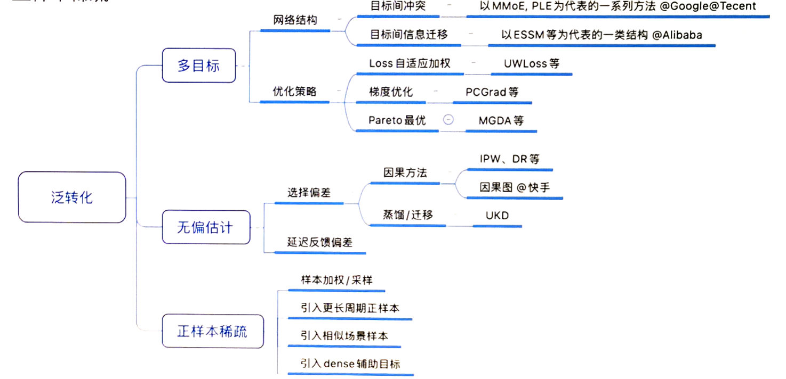
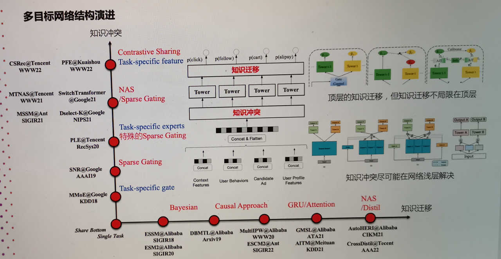
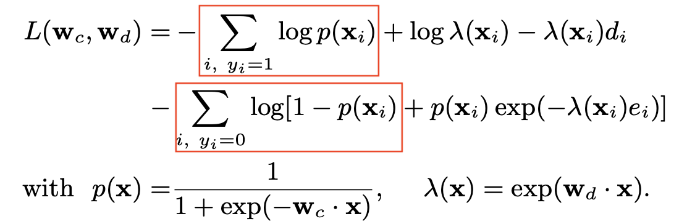
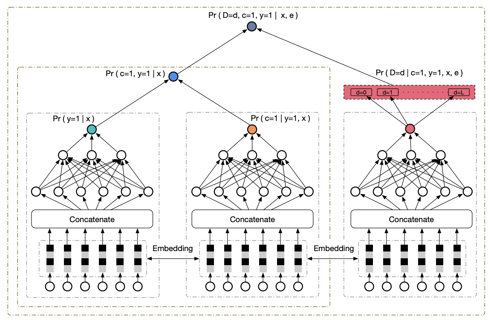
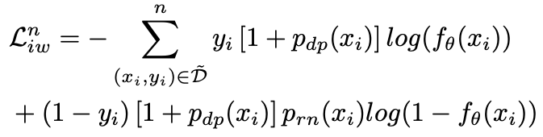

+++
title = 'CVR建模技术梳理'
date = 2024-05-28T17:49:08+08:00
draft = false
math = false
tags = []
+++

在之前的工作中负责过一段时间转化率的建模，这里对转化率建模的技术作一个简单梳理。



点击，一般意义上就是点了商品，转化，一般意义上是指下单/购买。但在电商或直播的漏斗中，中间可能还会经历一长串的链路：

- 传统电商：加购，收藏，店铺关注，收银台落地页，等等
- 直播电商：观看时长，点赞，吸粉，收藏，商品落地页 等等

通过优化中间的一长串漏斗，能一定程度使得最终的转化目标更大化。因此，多目标建模是转化建模必备技术。

# 多目标建模

说到多目标建模，为什么不采用多个单目标的模型呢？主要原因是商品的转化是一个极度稀疏的信号（有些场景<1%甚至0.1%量级），通过引入中间目标，不同目标的模型共享部分参数比如Embedding，有助于给转化模型的Embedding学习，缓解转化本身的稀疏问题；

一旦涉及到多目标，除了共享参数带来增益之外，有些情况也会存在目标间冲突的问题，典型的就是CTR和CVR一起建模，一些猎奇商品点击率很高，但是转化很低。因此，为了解决冲突，一方面做法是调整多目标的网络结构，比如腾讯的PLE就是用Gate针对不同的目标选择不同的Experts；另一种思路是通过梯度优化策略，如PCGrad在训练时把梯度冲突部分裁剪掉，保证不同目标间的梯度正交。当然两种解决冲突的方式可以一起用，但从个人实践的经验来看，PLE这种从本质上进行冲突信息分流的方式一般会更好些。

> ***思考：***
>
> 其实仔细去想，冲突信息在模型的越浅层解决越好。循着这个思路，参考PLE的思想，对于存在较大冲突目标的情况，是不是可以在更浅层Embedding层解决冲突，即每个task除了共享的embedding，还有自己独立的embeddig，即实现task specific embedding（TSE）？
>
> 我在直播电商的多目标中简单尝试过这种做法（含观看时长/完播、点赞、吸粉、店铺收藏目标，主要考虑时长和其它目标有些情况不完全一致），在PLE的基础上有额外的提升，只是上线时Embedding需要更多的存储空间，Inference计算量相比不变。



# 样本有偏的问题

转化建模还有一个大的问题时样本有偏，其中又有很多情况，常见的是延迟反馈偏差和选择偏差。

延迟反馈：即曝光-转化可能发生在几天之后，这就导致近几天的数据不能直接拿来训练，因为负样本是不准的，可能在未来转化为正样本。在Online Learning场景下，该问题尤为严重。业界也有不少方案在想办法缓解该问题。

**1. Modeling Delayed Feedback in Display Advertising**

DFM，业界最早关注该问题的，利用数据先验，将延迟转化的衰减过程建模成指数分布，考虑延迟反馈问题值得细读作为一个baseline。具体的，确定转化的情况下C=1，延迟天数D=d表示成下面的指数分布，

$$
Pr(D=d|X=x,C=1)=\lambda(x) \exp(-\lambda(x) d)
$$

其中$\lambda(x)$是[hazard function](https://web.stanford.edu/~lutian/coursepdf/unit1.pdf)，$\lambda(x)=\exp(w_d*x)$。根据该先验信息，就能推导出观察正样本的概率和观察到负样本的概率，最后通过极大似然估计得到模型的Loss Function，从原来的Binary Cross Entropy Loss变成如下：

从Loss看，其中两项和BCE Loss很像，在BCE Loss基础上分别对正负样本有个loss调整。具体看负样本：

- 当 $\lambda$ 很大或elapsed time $e_i$ 很大的时候，$p(x_i)\exp(-\lambda(x_i)e_i$ 接近0，表示这种情况下基本确定性的负样本；
- 当 $\lambda$ 和elapsed time $e_i$ 都很小的时候，$p(x_i)\exp(-\lambda(x_i)e_i$ 接近$p(x_i)$，这个时候负样本还有很大概率正样本；

DFM在DNN很容易实现：

- 首先需要一个小的Net表征$W_d$
- 将Loss Function从原来的BCE Loss变成上面的Loss

```python
dfm_logit = W_d * x # output of the Net

lambda_dfm = torch.exp(dfm_logit)
likelyhood_pos = label_cvr * (torch.log(pcvr) + dfm_logit - lambda_dfm * elapsed_days_sold)
likelyhood_neg = (1 - label_cvr) * torch.log( 1 - pcvr + pcvr * torch.exp(-lambda_dfm * elapsed_days_sold) )
dfm_loss_cvr = - (ikelyhood_pos + likelyhood_neg).mean()
```

[**2. Delayed Feedback Modeling for the Entire Space Conversion Rate Prediction**](https://arxiv.org/pdf/2011.11826)

相比DFM的指数衰减先验，这篇Paper ESDF用一个单独的Tower建模延迟转化，替代了DFM种的指数先验约束。其中y是否点击、c是最终是否转化、D是点击-转化的延迟时间。相比DFM的优点是不需要数据先验。


**3. [Capturing Delayed Feedback in Conversion Rate Prediction via Elapsed-Time Sampling](https://arxiv.org/pdf/2012.03245)**

还一种方法是，重要性采样。延迟反馈的问题核心还是一个样本权重的问题，最终体现在Loss上的改变，


其中$p_{dp}$是延迟正样本的概率，$p_{rn}$是最终负样本的概率，这两个值通过重要性采样计算得到。
