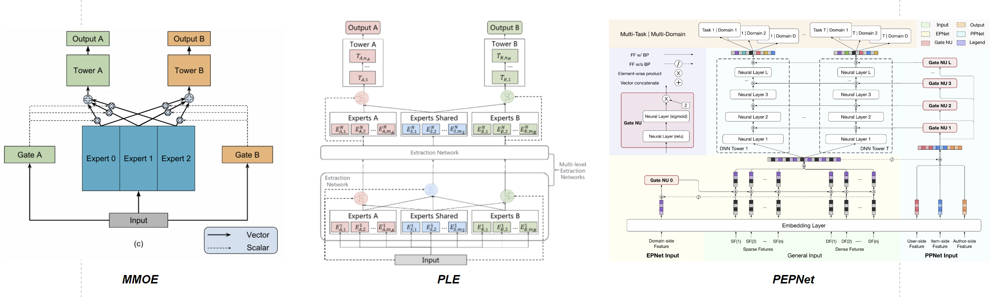
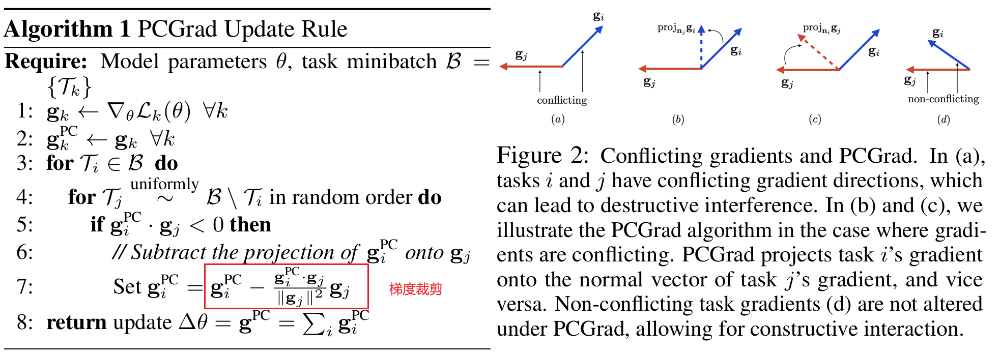
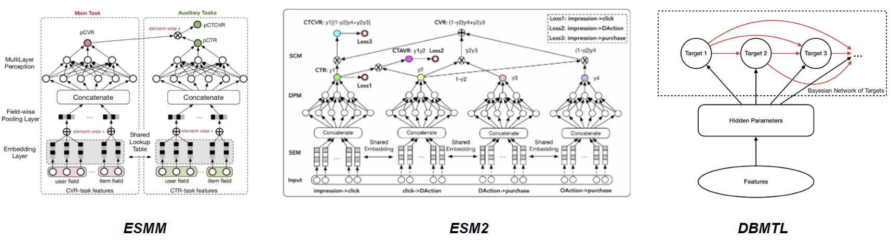
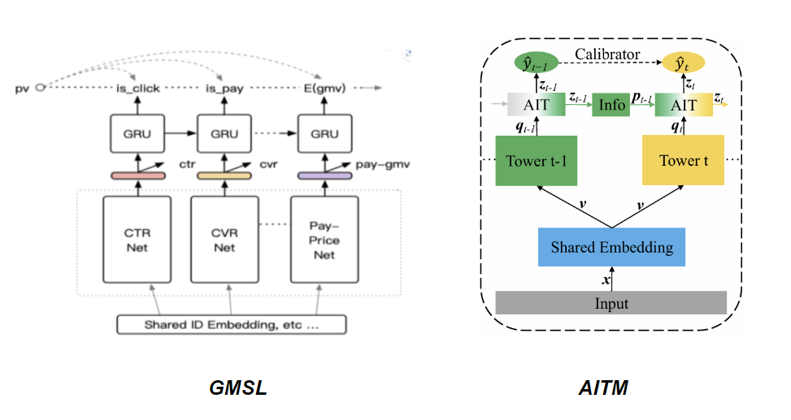
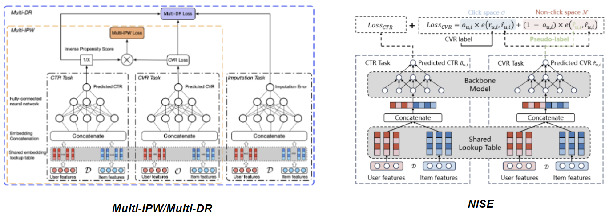

+++
title = 'CVR建模技术梳理'
date = 2024-05-28T17:49:08+08:00
draft = false
math = false
tags = ['ML', 'Recommendation']
+++

在之前的工作中负责过一段时间转化率的建模，这里对转化率建模的技术作一个简单梳理。


我把CVR建模中会遇到的主要问题分成3类（如图）：
1. __多目标建模__：CTR建模的点击，一般意义上就是点了商品或者实际中的label是进入落地页（Detailed Page Viewed, DPV），目标相对非常明确；而对于转化，一般意义上是指下单/购买。但是在电商或直播的漏斗中，点击到转化的中间可能还会经历一长串的非串行的链路，比如传统电商转化前存在`加购、收藏、店铺关注、收银台落地页`等行为，在直播电商中有`观看时长、点赞、吸粉、收藏、从直播间进入商详情页`等行为，通过优化中间的一长串漏斗，能一定程度使得最终的转化目标更大化。因此，多目标建模是转化建模必备技术。
2. __无偏估计__：CVR建模存在的2大主要偏差。
    - 选择偏差：CTR和CVR的实际线上inference空间是曝光（需要在曝光前给出cvr分作为排序依据），对CTR来说这不是问题因为模型的样本就是曝光空间。但是CVR不同，如果用点击空间样本训练，那就存在训练和线上打分空间不一致的情况；如果选择曝光样本训练CVR，那曝光未点击的样本在CVR模型中到底因该是正样本还是负样本呢？
    - 延迟反馈：转化可能发生在曝光后几天之后，站在当前的时间窗口，某个样本的转化label=0有可能是假负样本（因为它可能在未来几天变成正样本）。在Online Learning场景下，该问题尤为严重。业界也有不少方案在想办法缓解该问题。
3. __正样本稀疏__：转化的比例相比点击的比例要低很多，作为参考，某传统电商的CTR基本都在3%左右，转化小一个量级基本在千分有些场景甚至在万分。

## 多目标建模

说到多目标建模，为什么不采用多个单目标的模型呢？主要原因是商品的转化是一个极度稀疏的信号（有些场景<1%甚至0.1%量级），通过引入中间目标，不同目标的模型共享部分参数比如Embedding，有助于给转化模型的Embedding学习，缓解转化本身的稀疏问题。

一旦涉及到多目标，无外乎就是`知识冲突`和`知识迁移`两个维度（如下图，绘制于2022年左右）。多目标除了共享参数带来信息增益之外，有些情况也会存在目标间冲突的问题，典型的就是CTR和CVR一起建模，一些猎奇商品点击率很高，但是转化很低。


为了解决**知识冲突**，主要从2方面着手：
1. 多目标的网络结构：
- google的[MMoE](https://www.kdd.org/kdd2018/accepted-papers/view/modeling-task-relationships-in-multi-task-learning-with-multi-gate-mixture-)：针对不同的任务用不同的Gate。虽然MMoE设计考虑了共享信息，但为了归类方便，我且将他要解决的主要问题定位为冲突解决，因为要共享Share Bottom就能很好共享；
- 腾讯的[PLE](https://github.com/tangxyw/RecSysPapers/blob/main/Multi-Task/%5B2020%5D%5BTencent%5D%5BPLE%5D%20Progressive%20Layered%20Extraction%20%28PLE%29%20-%20A%20Novel%20Multi-Task%20Learning%20%28MTL%29%20Model%20for%20Personalized%20Recommendations.pdf)：不同的目标不仅用不同的Gate，而且不同目标还有自己独有的Experts达到冲突进一步解耦；如果从Task Specific的视角看，MMoE的Specific是Gate，PLE的Specific是Gate和Experts。
- 快手的[PEPNet](https://arxiv.org/abs/2302.01115)：既然可以Specific是Gate和Experts，那是不是还可以Task Specific的Features，PEPNet就是Specific的Feature，对输入加权，在模型的更浅层把冲突问题解决。



2. 多目标优化：最早的比如[UWLoss](https://arxiv.org/abs/1705.07115)对多目标自适应加权，但它的假设是多目标独立，很多情况下这个假设就没法满足；从模型角度来说，所有冲突的来源都来自于梯度的影响。如[PCGrad](https://arxiv.org/abs/2001.06782)在训练时把梯度冲突部分裁剪掉，保证不同目标间的梯度正交。沿着PCGrad后续有很多对梯度进行优化的方法。



当然，多目标结构和多目标优化方法可以一起使用，但从个人实践的经验来看，从网络结构上进行信息解耦，这种从本质上进行冲突信息分流的方式一般更容易拿到效果。**保证每个任务有一个自己的与其他任务毫不相关的信息通路，保证冲突信息能从Task-specific的通路传递到loss**。

为了实现**知识迁移**（即一个任务受益于另一个任务带来额外的提升）：
1. 根据业务先验信息，进行Bayesian转移概率建模：[ESMM](https://arxiv.org/abs/1804.07931)/[ESM2](https://arxiv.org/abs/1910.07099)这种，ESM2在ESMM基础上对后链路的行为做了更多的分解，更复杂些的比如DBMTL；



2. 不直接通过转移概率乘积建模，建模目标间的`序关系`：典型的比如lazada的GMSL利用GRU建模，以及美团[AITM](https://arxiv.org/abs/2105.08489)都可以认为是类似这种；



3. 解决偏置问题：针对CVR的曝光空间选择偏差，引入因果推断IPW（Inverse Propensity Weighting），如[Multi-IPW/Multi-DR](https://arxiv.org/abs/1910.09337)，以及RecSys24 Tecent最近的[NISE](https://dl.acm.org/doi/pdf/10.1145/3640457.3688151)，他们的出发点都是认为ESMM依然存在选择偏差；



4. NAS自动搜索模型结构：典型的[AutoHERI](https://dl.acm.org/doi/10.1145/3459637.3482061)在阿里妈妈场景下拿到了些效果，这种方向一般适合业务体量足够大的场景才去考虑，中小场景性价比不高。

有趣的是，大部分知识迁移的Paper都是考虑在Tower之后怎么进行融合，而知识冲突的研究基本考虑Tower之前怎么进行目标间信息的解耦。所以，上面列的，有很多知识迁移和知识冲突的方法是互补的，两者可以同时使用，比如PLE + ESMM，PLE + IPW等。__就个人经验来说，MMoE和PLE这类模型即插即用，更通用，每个目标要再调整起来也更容易，相比ESMM这种需要先验的结构在更多场景被使用__。LLM都是在往MMoE上发力，这是不是不同场景另一种殊途同归呢？

> ***思考：***
>
> 1. 其实仔细去想，**冲突信息在模型的越浅层解决越好**。循着这个思路，参考PLE的思想，对于存在较大冲突目标的情况，是不是可以在更浅层Embedding层解决冲突，即每个task除了共享的embedding，还有自己独立的embeddig，即实现**task specific embedding（TSE）**？我在直播电商的多目标中简单尝试过这种做法（含观看时长/完播、点赞、吸粉、店铺收藏目标，主要考虑时长和其它目标有些情况不完全一致），在PLE的基础上有额外的提升，只是上线时Embedding需要更多的存储空间，Inference计算量相比不变。
> 2. 有同学可能了解过[MaskNet](https://arxiv.org/abs/2102.07619)，它是否能用在多目标中实现Task-specific features？

## 样本有偏的问题

选择偏差很多时候都是结合类似ESMM的结构去缓解，上面多目标建模中已经有所提及。这里主要讨论延迟反馈带来的偏差问题。

### 延迟反馈

**1. Modeling Delayed Feedback in Display Advertising**

DFM，业界最早关注该问题的，利用数据先验，将延迟转化的衰减过程建模成指数分布，考虑延迟反馈问题值得细读该Paper作为一个baseline。具体的，确定转化的情况下C=1，延迟天数D=d表示成下面的指数分布，

$$
Pr(D=d|X=x,C=1)=\lambda(x) \exp(-\lambda(x) d)
$$

其中$\lambda(x)$是[hazard function](https://web.stanford.edu/~lutian/coursepdf/unit1.pdf)，$\lambda(x)=\exp(w_d*x)$。根据该先验信息，就能推导出观察正样本的概率和观察到负样本的概率，最后通过极大似然估计得到模型的Loss Function，从原来的Binary Cross Entropy Loss变成如下：

从Loss看，其中两项和BCE Loss很像，在BCE Loss基础上分别对正负样本有个loss调整。具体看负样本：

- 当 $\lambda$ 很大或elapsed time $e_i$ 很大的时候，$p(x_i)\exp(-\lambda(x_i)e_i$ 接近0，表示这种情况下基本确定性的负样本；
- 当 $\lambda$ 和elapsed time $e_i$ 都很小的时候，$p(x_i)\exp(-\lambda(x_i)e_i$ 接近$p(x_i)$，这个时候负样本还有很大概率正样本；

DFM在DNN很容易实现：

- 首先需要一个小的Net表征$W_d$
- 将Loss Function从原来的BCE Loss变成上面的Loss

```python
# ref: https://github.com/xiahouzuoxin/torchctr/blob/e967324d446328357379cd649d367a5c4b2fac32/torchctr/losses/classification.py#L3

dfm_logit = W_d * x # output of the Net

lambda_dfm = torch.exp(dfm_logit)
likelyhood_pos = label_cvr * (torch.log(pcvr) + dfm_logit - lambda_dfm * elapsed_days_sold)
likelyhood_neg = (1 - label_cvr) * torch.log( 1 - pcvr + pcvr * torch.exp(-lambda_dfm * elapsed_days_sold) )
dfm_loss_cvr = - (ikelyhood_pos + likelyhood_neg).mean()
```

[**2. Delayed Feedback Modeling for the Entire Space Conversion Rate Prediction**](https://arxiv.org/pdf/2011.11826)

相比DFM的指数衰减先验，这篇Paper ESDF用一个单独的Tower建模延迟转化，替代了DFM种的指数先验约束。其中y是否点击、c是最终是否转化、D是点击-转化的延迟时间。相比DFM的优点是不需要数据先验。


通过多目标进行延迟反馈建模的其他类似方案：
- MMDFM：https://mp.weixin.qq.com/s/VosvjdSn6c-qhOYeFBEqUQ

**3. [Capturing Delayed Feedback in Conversion Rate Prediction via Elapsed-Time Sampling](https://arxiv.org/pdf/2012.03245)**

还一种方法是，重要性采样。延迟反馈的问题核心还是一个样本权重的问题，最终体现在Loss上的改变，


其中$p_{dp}$是延迟正样本的概率，$p_{rn}$是最终负样本的概率，这两个值通过重要性采样计算得到。

## 正样本稀疏

除了类似ESMM那样引入更Dense的辅助信号外。另外比较容易见效的方式就是正样本加权，常见的加权方法：

**WCE**：给正样本一个固定的权重
$$
Loss = -\sum_{i=1}^{N} \sum_{c=1}^{C} w_c \, y_{i,c} \, \log(p_{i,c})
$$

**Focal Loss**：自适应样本权重，最早用在CV Detection中处理样本不平衡问题，可以理解为增强版的WCE
- 二分类：
    $$
    FL(p_t) = - \alpha_t (1 - p_t)^\gamma \log(p_t)
    $$

    其中$(1-p_t)^{\gamma}$用于控制难易样本程度，$\alpha_t$用于控制正负样本学习权重。
- 多分类：
    $$
    FL(p_t) = - \sum_{i=1}^{N} \sum_{c=1}^{C} \alpha_c (1 - p_{i,c})^\gamma y_{i,c} \log(p_{i,c})
    $$

> ***思考：***
> ESMM中是否能对ctcvr目标加权，会有什么问题？MMoE/PLE这类结构呢？

还有种思路解决样本稀疏问题——即全场景建模：
1. 转化的label考虑全场景的转化，即当前场景曝光过，但是在其他场景转化的；
2. 细分场景用主站场景的数据做迁移学习，比如淘宝细分场景用淘宝首猜的数据迁移学习。
