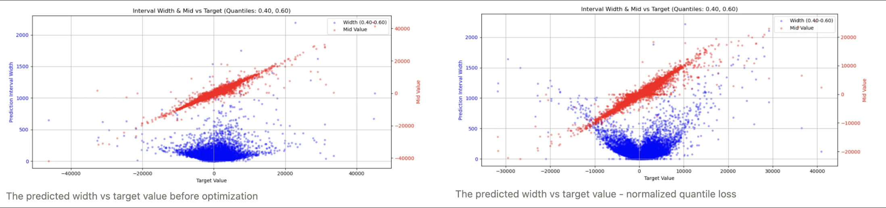
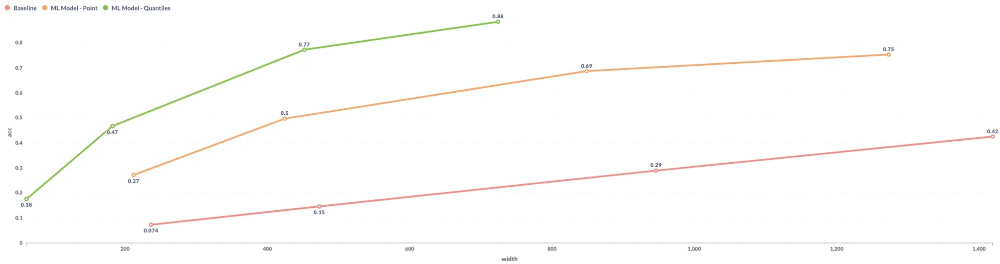

+++
title = 'DNN回归模型中的不确定性估计'
date = 2025-08-22T15:19:00+08:00
draft = false
math = true
tags = ['ML']
+++


## 背景

Jerry.ai是一家欧美主营车险的中介平台，对接几十家车险公司，每年的报价（quoting）请求数上亿。但由于报价系统（quoting system）以及保险公司（carrier）的一些原因，用户每次自定义险种（custom coverages），都要等待大概30s-1min钟的时间，quoting system的返回报价结果，影响用户体验。因此对于这种场景，需要一个模型快速返回用户自定义险种的报价，以便用户决策。模型要做到的最终效果就是：
1. 用户修改coverage的值。比如Bodily Injury Limitation从50万增加到100万，Collision Deductible从1000变成500；
2. 预测保费变化多少，显示保费变化

预测保险报价，从纯ML的角度，这是一个典型的回归问题，即 $f(price|X)$，通常采用MSE Loss训练模型即可。本文则是通过建模目标的分布，
1. 提升最终预估效果，相比均值回归目标MAPE降低10个百分点，区间效果也比均值结果好很多。其中区间效果主要是指PICP / MPIW，PICP - Prediction Interval Coverage Probability，MPIW - Mean Prediction Interval Width。
2. 提升了用户体验，最终用户看到的结果类似于“90%概率价格在100-105之间”


## 回归建模的不确定性估计

### 1. 预测期望值并提供固定范围

模型仅预测价格的期望值，采用MSELoss，并提供一个固定的预测范围（例如，-10% 到 10%）来约束模型的应用。

$$
\hat{y}±10\%
$$

### 2. 高斯回归（Gaussian Regression）

该方法假设预测服从高斯分布，模型同时输出均值（$\mu$）和方差（$\sigma^2$）。损失函数基于最大似然估计，计算高斯分布的NLL（Negative Log Likelihood）Loss：

$$
\mathcal{L}(y|\mu,\sigma) 
= -\log \left( \frac{1}{\sqrt{2\pi\sigma^2}} \exp \left( -\frac{(y - \mu)^2}{2\sigma^2} \right) \right)
= \frac{1}{2} \log(2\pi) + \log(\sigma) + \frac{(y - \mu)^2}{2\sigma^2}
$$

在实践中，我们通常会忽略常数项 $\frac{1}{2} \log(2\pi)$，因为它不影响最终的优化，且为了数值稳定性，通常是让DNN输出 $log{\sigma^2}$：

$$
\min 0.5 * \left( \log \sigma^2 + \frac{(y - \mu)^2}{\sigma^2} \right)
$$

当进行预测时，我们可以根据模型的输出（期望值 $u(x)$ 和标准差 $\sigma(x)$），以及希望输出的置信区间，来构造预测的区间：

$$
[u(x) - z_a \sigma(x), u(x) + z_a \sigma(x)]
$$

其中 $z_a$ 是与所需置信水平相关的标准正态分布分位数（例如，对于95%的置信区间，$z_a \approx 1.96$）。

```python
def gaussian_nll_loss(y_pred, y_pred_logvar, y_true):
    """
    Negative log-likelihood loss for Gaussian distribution.
    Args:
        y_pred: Predicted mean values.
        y_pred_logvar: Predicted log variance values. More stable than using variance directly.
        y_true: True values.
    Returns:
        Computed negative log-likelihood loss.
    """
    if train_configs.logvar_max is not None or train_configs.logvar_min is not None:
        y_pred_logvar = torch.clamp(y_pred_logvar, min=train_configs.logvar_min, max=train_configs.logvar_max)
    var = torch.exp(y_pred_logvar)
    # Compute the negative log likelihood
    nll = 0.5 * (torch.log(var) + ((y_true - y_pred) ** 2) / var)
    return nll.mean()
```

### 3. 使用分位数损失（Quantile Loss）

Gaussian NLL Loss的问题是均值和方差一般不在一个尺度（比如，目标均值可能在0附近，但是方差可能很大），训练的稳定性较差（实际实验效果也是如此）。相比而言，Quantile Loss的训练会稳定很多，且具有Model Ensemble的效果，作为我们最终的方案被采用。我们可以通过Quantile Loss/Pinball Loss，输出第5和第95百分位数点，以提供预测的不确定性信息。分位数q的损失的计算方式如下：
$$
QuantileLoss(q, y, \hat{y}) =
\begin{cases}
q \cdot (y - \hat{y}), & \text{if } y \geq \hat{y} \\
(1 - q) \cdot (\hat{y} - y), & \text{if } y < \hat{y}
\end{cases}
$$

为了简化实现，我们可以将分位数损失表示为：
$$
QuantileLoss(q, y, \hat{y}) = \max(q * (y - \hat{y}), (q - 1) * (y - \hat{y}))
$$
通过预估多个多个0.5中值对称的分位数，则可实现 {p=0.1, p=0.9}等价80%置信区间的效果。

另外，所有对称分位数的预估结果通过平均，可以得到中值的预估。**通过实践验证，该结果也比直接使用MSE预估期望值MAPE要好很多，应该是多个分位数计算平均的过程起到了多个Model Ensemble的效果**。

在我们价格预估的场景中，更关注价格的相对变化准确度，我发现原始Quantile Loss有个问题就是，即使预估的均值为0，它也可能给一个很大的区间。为了缓解这个问题，我对原始的Quantile Loss做了Normalization的调整。通过在分位数损失函数中添加一个 `|y|+eps` 缩放因子到分母来归一化误差项：
$$
error = \frac{y - \hat{y}}{|y| + eps}
$$

$$
QuantileLoss(p, y, \hat{y}) =
\begin{cases}
q \cdot error & \text{if } y \geq \hat{y} \\
(1 - q) \cdot (-error), & \text{if } y < \hat{y}
\end{cases}
$$

其中 `eps` 是一个很小的常数（我的场景介于 10-100 之间），用于防止在训练期间当 `|y|` 值非常小时出现不稳定。

```python
def quantile_loss(y_pred, y_true, quantiles=0.5, normalize=True):
    """
    Quantile loss function.
    Args:
        y_pred: Predicted values.
        y_true: True values.
        quantiles: Quantile to compute the loss for (default is 0.5 for median).
    Returns:
        Computed quantile loss.
    """
    if not isinstance(quantiles, (list, tuple)):
        quantiles = [quantiles]
    
    assert len(quantiles) == y_pred.shape[1], \
        f"Number of quantiles ({len(quantiles)}) must match the second dimension of y_pred ({y_pred.shape[1]})"

    y_true = y_true.flatten()  # shape: (batch_size,)
    total_loss = 0.0
    for i, q in enumerate(quantiles):
        if not (0 < q < 1):
            raise ValueError(f"Quantile must be in (0, 1), got {q}")
        error = y_true - y_pred[:, i]
        if normalize:
            scale = torch.abs(y_true) + 10  # add a constant to avoid high variance in error
            error = error / scale  # normalize the error
        loss = torch.max(q * error, (q - 1) * error) # shape: (batch_size,)
        total_loss += loss.mean()
    
    return total_loss / len(quantiles)
```

下图是Normalized Quantile Loss（右）和Vanilla Quantile Loss（左）的对比，横轴是真实目标值，红色点是预估均值分布，蓝色点是预估宽度分布，会发现修正后表现目标值越大区间宽度才越大。但这也可能一种顾此失彼的调整，因为目标值比较大的时候，对应的预估宽度会比Vanilla Quantile Loss的要大，可能需要根据业务需求进行取舍，我也在进一步的研究中。



### 4. 效果对比
如下是规则系统（Baseline）、MSE Loss（ML Model - Point）和Quantile Loss的对比，横轴是预估区间宽度，纵轴是PICP即真实值落在区间的精度。



## 其他问题

#### DNN回归模型中的Dropout

我们都知道Dropout是现在DNN模型的标配，但是到回归模型中，引入dropout说不定会有一些问题。我把dropout去掉才达到稳定的效果提升。

究其本质是，**训练阶段使用dropout会导致隐藏层输出的方差与验证阶段不一致，这种差异在通过非线性激活函数后会进一步放大，最终导致模型在验证集上的性能下降**。详细可参考
1. 知乎问题 [为什么回归问题不能用Dropout](https://zhuanlan.zhihu.com/p/17557199827)
2. Effect of Dropout Layer on Classical Regression Problems 论文通过实验验证了上述结论
3. [R-Drop](https://zhida.zhihu.com/search?content_id=252533465&content_type=Article&match_order=1&q=R-Drop&zhida_source=entity): Regularized Dropout for Neural Networks 论文提出了一种改进方法，有效缓解了分类任务中dropout导致的训练-验证不一致问题


