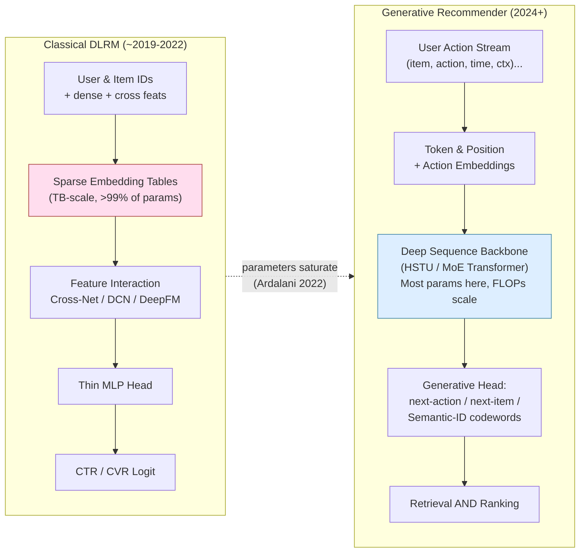
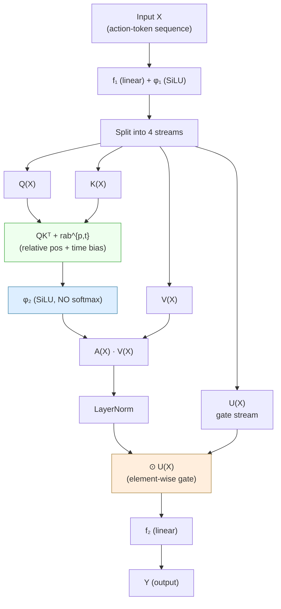
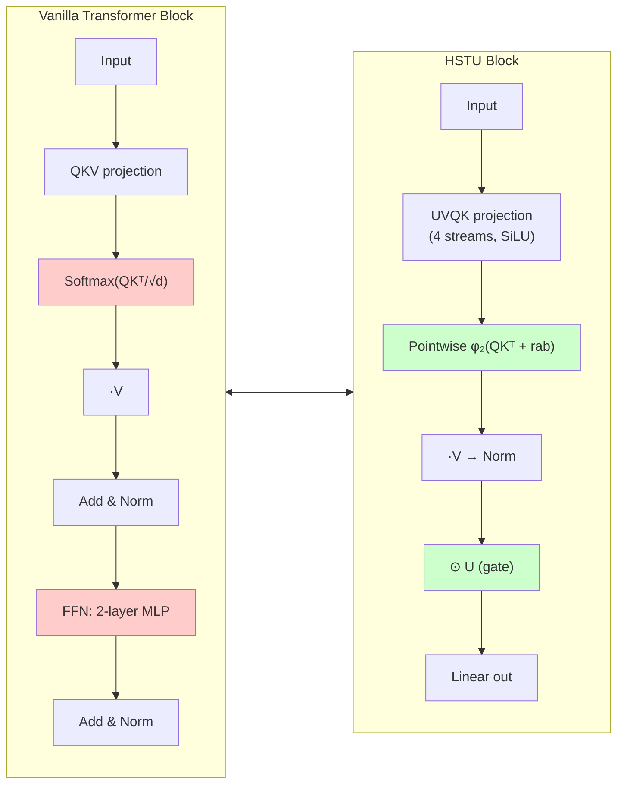
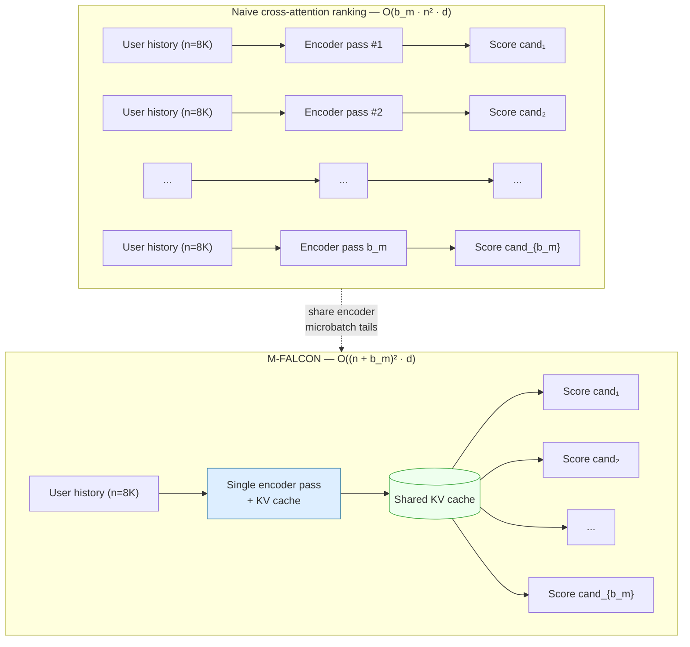
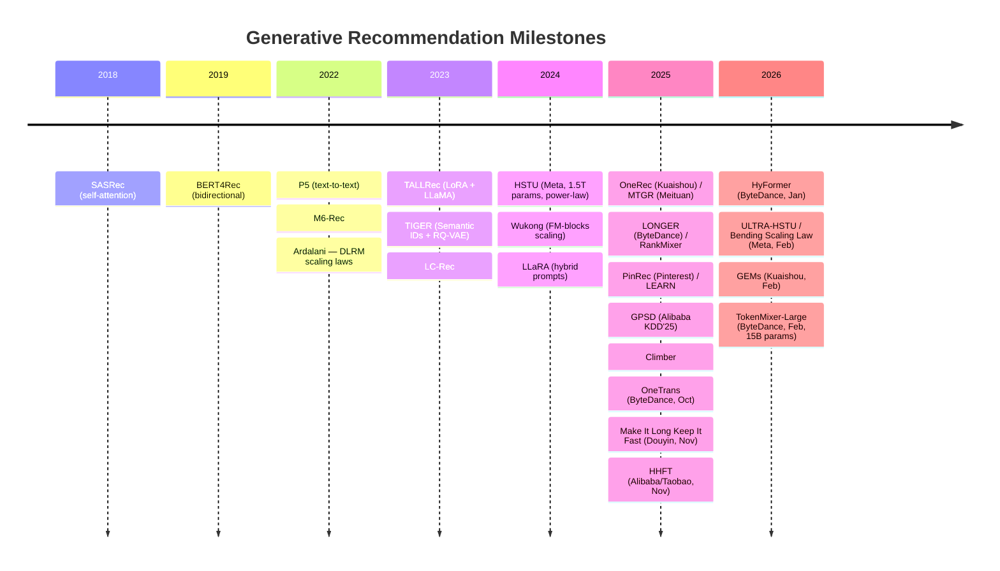
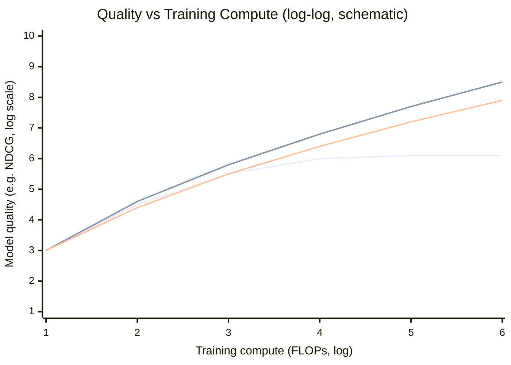

+++
title = 'Generative Recommendation'
date = 2026-05-07T18:36:39+08:00
draft = true
mermaid = true
math = true
tags = []
+++

> Anchored on Meta's HSTU paper (*"Actions Speak Louder than Words: Trillion-Parameter Sequential Transducers for Generative Recommendations"*, ICML 2024), this survey traces how recommendation systems are migrating from feature-engineered DLRMs to end-to-end generative transducers — and why this shift unlocks the same power-law scaling that LLMs enjoy.

---

## 1. Why Scaling Laws Matter for RecSys — and Why DLRMs Hit a Wall

### 1.1 The LLM playbook does not transfer for free

In NLP and vision, the recipe is well understood: bigger model + more data + more compute → predictably better loss, governed by Hoffmann/Kaplan power-laws. In ranking and retrieval, this recipe historically *failed*:

- The classical DLRM stack (Naumov et al., 2019) is dominated by **sparse embedding tables** (often >99% of params), with a thin MLP on top of dense and crossed features.
- Ardalani et al. ([*Understanding Scaling Laws for Recommendation Models*, 2022](https://arxiv.org/abs/2208.08489)) characterize scaling along three axes — **data, parameters, compute** — and report that **parameter scaling has saturated** for traditional CTR DLRMs. Adding more embeddings or wider MLPs gives sub-linear, often flat, returns. Data scaling is the only remaining lever.
- Embedding tables grow to terabytes, but compute (FLOPs/example) is small and largely sequential — so accelerator utilization is poor.

### 1.2 The four "no-free-lunch" obstacles

Anyone who has tried to scale a production ranker has seen these:

1. **Cardinality and non-stationarity.** Item catalogs are O(10⁹), churn daily; user vocabularies are O(10⁹) too. A static tokenizer and frozen-vocab transformer don't fit.
2. **Heterogeneous features.** Categorical IDs, numerics, cross features, multi-modal content, contexts (time/geo/device). Plugging them all into one sequence is non-trivial.
3. **Latency budget.** Ranking serves at p99 < 100 ms over thousands of candidates per request. A vanilla transformer over an 8K user history × 1K candidates is infeasible.
4. **Streaming, online learning.** Users churn, items launch, signals decay. Models must update continuously, which conflicts with epoch-based pretraining recipes.

### 1.3 What "generative" actually buys you

Re-framing recommendation as **next-token / next-action prediction** over a unified user-action sequence converts the bottleneck from *embedding-table size* to *compute on the sequence model*. That puts RecSys back on the same accelerator-friendly curve as LLMs: more FLOPs, more parameters in the dense backbone, more data → better quality, predictably. HSTU's headline result is exactly this — a power-law over **3 orders of magnitude** of training compute, up to GPT-3 / LLaMA-2 scale.

**Figure 1 — The paradigm shift.** DLRMs spend their parameter budget on huge sparse embedding tables and a thin MLP; generative recommenders move the budget into a dense sequence backbone whose FLOPs are predictable, accelerator-friendly, and scale with depth.



---

## 2. The Anchor Paper: HSTU (Meta, ICML 2024)

[Zhai et al., *Actions Speak Louder than Words*, arXiv:2402.17152](https://arxiv.org/abs/2402.17152)

### 2.1 Reformulation: ranking and retrieval as one sequence

HSTU unifies retrieval and ranking into a **sequential transduction** task on a single chronological stream of `(user, item, action)` tokens. "Actions" — clicks, watches, purchases, dwell, like — are first-class tokens, not auxiliary labels. Hence the title: *actions* (behavior) carry more signal than *words* (textual descriptions) for recommendation.

### 2.2 The HSTU block

A dense transformer-style block but explicitly co-designed for high-cardinality streaming data:

```
U, V, Q, K = Split(φ₁(f₁(X)))                   # pointwise SiLU projections
A(X)V(X) = φ₂(Q Kᵀ + rab^{p,t}) V               # pointwise (no softmax) attention + relative bias
Y(X)    = f₂( Norm(A V) ⊙ U(X) )                # element-wise gating instead of FFN
```

**Figure 2 — Inside one HSTU block.** Compared to a vanilla transformer, the block has *four* projections (U, V, Q, K) instead of three; the attention is normalized pointwise (SiLU) rather than over the row (softmax); and the FFN is replaced by an element-wise gate `Norm(A·V) ⊙ U` that performs multiplicative feature interaction.



**Figure 3 — Side-by-side: Transformer block vs HSTU block.** The two changes that matter most for ranking quality at scale are (1) pointwise attention normalization and (2) element-wise multiplicative gating in place of an FFN.



Three departures from a vanilla transformer:

| Design | HSTU choice | Why |
|---|---|---|
| Attention normalization | **Pointwise** (SiLU), no softmax | Softmax is dominated by frequent-item patterns; pointwise preserves intensity signal needed for ranking. |
| Feature interaction | **Element-wise gating** `Norm(AV) ⊙ U` | Replaces FFN; gives multiplicative cross-feature interaction that DLRM-style cross modules used to provide. |
| Position info | **Relative attention bias `rab^{p,t}`** with both position and time | Recommendation cares about wall-clock time deltas, not just token order. |

Ablation (Table 4 in the paper, 100B examples): swapping pointwise attention back to softmax degrades ranking NE from **0.4937 → 0.5067**, and a vanilla transformer is unstable (NaN) at this scale.

### 2.3 M-FALCON: how ranking 1K candidates over an 8K history becomes feasible

The naive cost of running a transformer over `(user_history ∥ candidate)` for `b_m` candidates is `O(b_m · n² · d)`. **M-FALCON** modifies attention masks/biases so that the encoder pass is shared across candidates — only the candidate-specific tail differs — yielding `O((n + b_m)² · d)`. With encoder-level KV caching, Meta reports a **285× more complex cross-attention model at 1.5× the throughput** of the prior production model.

**Figure 4 — Naive ranking vs M-FALCON micro-batched ranking.** Top: per-candidate forward pass repeats the user-history encode `b_m` times. Bottom: encode the user history once, cache the KV state, then attend `b_m` candidate tails against the same cache.



### 2.4 Stochastic Length — sub-quadratic on long histories

Instead of windowing user history (which destroys long-tail engagement signals), HSTU **probabilistically truncates** sequences exceeding `N^{α/2}` with probability `1 − N^α / nᵢ²`. At α = 1.6 over 4,096-token sequences this gives **80.5% sparsity** with only 0.2% NE degradation — and reduces attention to `O(N^α · d)`.

### 2.5 Headline numbers

**Figure 5 — Authoritative figures from the HSTU paper (Zhai et al. 2024).** Reproduced via the arXiv HTML build of the paper.

- *DLRM vs HSTU architecture side-by-side* (paper Fig. 3): 
- *Stochastic-length impact on long sequences* (paper Fig. 4): 
- *Encoder efficiency — train NE, train speedup, inference speedup* (paper Fig. 5): 
- *Scaling-law curves: DLRM vs GR for retrieval and ranking* (paper Fig. 7): 


- **Quality:** up to +65.8% NDCG over baselines on synthetic / public sets; +12.4% online A/B at deployment.
- **Speed:** 5.3×–15.2× faster than FlashAttention-2 transformers at 8K seq.
- **Scale:** 1.5T parameters, deployed on multiple surfaces serving billions of users.
- **The headline:** model quality **scales as a power-law of training compute over 3 orders of magnitude**, matching GPT-3 / LLaMA-2 regimes — the first time a recsys has demonstrated this.

This last result is the load-bearing claim of the paper. It promises that the LLM-style "buy more compute, get more quality" investment thesis now applies to recsys.

---

## 3. Related Work — Grouped by Generative Strategy

I cluster the (cite > 20) literature into **five cohorts**, ordered roughly by how much they commit to the generative paradigm.

**Figure 6 — Cohort taxonomy.** Two orthogonal axes drive the design choice: the *item representation* (raw ID → text → semantic codeword → action token) and the *training objective* (discriminative softmax → generative LM → generative transducer at scale).

```mermaid
flowchart TB
    ROOT["Generative Recommendation"]
    ROOT --> A["A. Pre-Generative<br/>(seq transformers)"]
    ROOT --> B["B. LLM-as-Recommender<br/>(text-first)"]
    ROOT --> C["C. Semantic-ID<br/>Generative Retrieval"]
    ROOT --> D["D. Scaling-First Industrial<br/>Generative Recommenders"]
    ROOT --> E["E. Scaling-Law<br/>Foundations"]

    A --> A1[SASRec — 2018]
    A --> A2[BERT4Rec — 2019]

    B --> B1[P5 — 2022]
    B --> B2[M6-Rec — 2022]
    B --> B3[TALLRec — 2023]
    B --> B4[LLaRA — 2024]

    C --> C1[TIGER — 2023]
    C --> C2[LC-Rec — 2024]
    C --> C3[LEARN — 2025]

    D --> DA["D1. Generative<br/>Transducers"]
    D --> DB["D2. Scaling Feature-<br/>Interaction Backbone"]
    D --> DC["D3. Scaling Long-<br/>Sequence Modeling"]
    D --> DD["D4. Gen. Pretrain →<br/>Discriminative Rank"]

    DA --> D1[HSTU — 2024 / Meta]
    DA --> D3[OneRec — 2025 / Kuaishou]
    DA --> D4[MTGR — 2025 / Meituan]
    DA --> D6[PinRec — 2025 / Pinterest]

    DB --> D2[Wukong — 2024 / Meta]
    DB --> D5[RankMixer — 2025 / ByteDance]
    DB --> D7[TokenMixer-Large — 2026 / ByteDance]
    DB --> D8[HHFT — 2025 / Alibaba]
    DB --> D9[OneTrans — 2025 / ByteDance]
    DB --> D10[HyFormer — 2026 / ByteDance]

    DC --> D11[LONGER — 2025 / ByteDance]
    DC --> D12[GEMs — 2026 / Kuaishou]
    DC --> D13[Make It Long Keep It Fast — 2025 / Douyin]
    DC --> D14[ULTRA-HSTU — 2026 / Meta]

    DD --> D15[GPSD — 2025 / Alibaba]

    E --> E1[Ardalani et al. — 2022]
    E --> E2[Climber — 2025]

    style D fill:#def,stroke:#48a
    style D1 fill:#def
    style C fill:#efe,stroke:#4a4
    style B fill:#fed,stroke:#a84
```



**Figure 7 — Timeline of key papers.** The 2022–2024 window contains both the diagnosis (Ardalani's scaling-law paper) and the cure (HSTU). 2025 is the year industrial replication arrived from every major short-video / e-commerce platform; 2026 is when the focus shifts to *bending* the curve and to fusing long-sequence + feature-interaction scaling into one backbone.



### Cohort A: Sequential Transformer Recommenders (Pre-Generative)

These are the architectural ancestors. They treat recommendation as next-item prediction but keep the discriminative softmax-over-catalog head and per-task training.

| Paper | Year / Venue | Key idea |
|---|---|---|
| [SASRec — Kang & McAuley](https://arxiv.org/abs/1808.09781) | ICDM 2018 | First self-attention over user sequences; left-to-right next-item prediction. The de-facto baseline for almost every paper below. |
| [BERT4Rec — Sun et al.](https://arxiv.org/abs/1904.06690) | CIKM 2019 | Bidirectional encoder with **Cloze (masked-item)** training. Beats SASRec by leveraging both-side context. Uses BERT-style pretraining but no semantic tokens. |

**Critique.** Both architectures are bound by per-item softmax heads with `|V|` ≈ 10⁸–10⁹. Memory and compute scale with catalog size, not with model depth, so they don't access the LLM-style scaling regime. They also lack action-type modeling — every item is a token, every click is a label.

---

### Cohort B: LLM-as-Recommender (Text-First Generative)

These cast recommendation as a *text* sequence task on top of a pretrained LLM. The hope is to inherit world knowledge and cold-start generalization; the price is poor latency and a semantic gap with collaborative signal.

| Paper | Year | Approach |
|---|---|---|
| [P5 — Geng et al.](https://arxiv.org/abs/2203.13366) | RecSys 2022 | Unifies rating prediction, sequential rec, explanation, review summarization, direct rec into one **text-to-text** model with personalized prompts. Pioneered the "Pretrain, Prompt, Predict" paradigm for RecSys. |
| [M6-Rec — Cui et al.](https://arxiv.org/abs/2205.08084) | 2022 | Repurposes M6 (GPT-3-ish industrial LM) as an open-ended recommender; supports retrieval, ranking, zero-shot, conversation. Adds prompt-tuning + late-interaction + early-exit for serving. |
| [TALLRec — Bao et al.](https://arxiv.org/abs/2305.00447) | RecSys 2023 | LoRA-tunes LLaMA-7B with two stages (Alpaca tuning → rec instruction tuning). Astonishing data efficiency: AUC 67 with only 16 examples on MovieLens. |
| [LLaRA — Liao et al.](https://arxiv.org/abs/2312.02445) | SIGIR 2024 | **Hybrid prompts**: combines ID-based embeddings from a SASRec-like model with textual item features. Curriculum: first text-only, then progressively inject behavioral embeddings. |

**Critique.** The cohort is academically interesting but **not the path to scaling-law gains**. The LLM backbone is frozen or thinly fine-tuned, so its dense compute is wasted re-deriving what an embedding table already knows. None of these methods are deployed as the *primary* ranker at billion-user scale. They shine in cold-start, explanation, and conversational rec — niches where natural language is the right medium.

---

### Cohort C: Semantic-ID Generative Retrieval

The pivotal idea: replace the `|V|`-way softmax with a **short sequence of discrete codewords** (a "Semantic ID") that represent each item, then train an encoder-decoder to autoregressively generate the next item's codeword sequence. This is a clean port of *generative retrieval* (à la DSI for documents) to RecSys.

| Paper | Year | Approach |
|---|---|---|
| [TIGER — Rajput et al.](https://arxiv.org/abs/2305.05065) | NeurIPS 2023 | First Semantic-ID generative recommender. Uses a SentenceT5 encoder over item content → **RQ-VAE** for hierarchical residual quantization → seq2seq transformer that decodes the next item's codeword tuple. +17% Recall@5, +29% NDCG@5 over SASRec; strong cold-start because codewords share content semantics. |
| [LC-Rec — Zheng et al.](https://arxiv.org/abs/2311.09049) | ICDE 2024 | Argues TIGER's IDs encode **only content**, not collaborative signal. Adds learning-based vector quantization with **uniform semantic mapping** and alignment-tuning tasks that teach the LLM to bridge collaborative ↔ language semantics. ~25% hit-rate lift over LLM-rec baselines. |
| [LEARN — Jia et al.](https://arxiv.org/abs/2405.03988) | AAAI 2025 (Kuaishou) | A practical industrial bridge: a frozen LLM acts as a **Content-Embedding Generator (CEG)** in a twin-tower setup; the LLM-derived vectors are injected as features into the existing ranker. Pragmatic, conservative, deployable. |

**Why this cohort matters.** Semantic IDs decouple model depth from catalog size. They also give compositional generalization to brand-new items: any item with content embeddings can be tokenized without retraining. Cold-start improvement is the most consistent empirical win across this cohort.

**Open issues.** Codebook collapse, the "hourglass phenomenon" in residual quantization, and a quality gap vs. ID-based retrieval on warm head items.

---

### Cohort D: Scaling-First Industrial Generative Recommenders

This is where HSTU lives, alongside the wave of **2024–2026 industrial papers** that take HSTU's recipe (action-token sequence, dense backbone, scaling-law training) and adapt it to their own production constraints. The cohort has grown large enough that I split it into four sub-cohorts by where the scaling pressure is applied: the *generative head*, the *feature-interaction backbone*, the *user-history length*, or via *generative pretraining*.

#### D1 — Generative Transducers (unified retrieval + ranking)

| Paper | Owner | Year | Distinctive contribution |
|---|---|---|---|
| [HSTU — Zhai et al.](https://arxiv.org/abs/2402.17152) | Meta | 2024 | The reference architecture. Pointwise gated attention, M-FALCON, stochastic length, demonstrated power-law scaling. |
| [OneRec — Deng et al.](https://arxiv.org/abs/2502.18965), [tech report](https://arxiv.org/abs/2506.13695) | Kuaishou | 2025 | **End-to-end** retrieval+ranking in one encoder-decoder with **sparse MoE** for capacity, **session-wise generation** instead of point-wise next-item, and **DPO-style preference alignment** with a learned reward model. Deployed for 25% of Kuaishou QPS, +1.6% watch-time, +0.54% app-stay-time. |
| [MTGR — Han et al.](https://arxiv.org/abs/2505.18654) | Meituan | 2025 | Builds on HSTU but **retains DLRM cross-features**. Adds **Group-Layer Normalization (GLN)** for heterogeneous semantic spaces and dynamic masking to prevent leakage. 65× more FLOPs/sample than the prior DLRM. |
| [PinRec — Pinterest team](https://arxiv.org/abs/2504.10507) | Pinterest | 2025 | First public production-grade generative retrieval at Pinterest scale: **outcome-conditioned multi-token generation** (condition on repin / click / save). +0.55% time spent, +4.01% Homefeed clicks. |

#### D2 — Scaling the Feature-Interaction Backbone (the "ranker stays cascade, but goes huge")

These papers accept the retrieval/ranking cascade and instead push the *ranking model* itself to billions of params with constant latency, by replacing softmax self-attention with mixing/factorization blocks that GPUs love.

| Paper | Owner | Year | Distinctive contribution |
|---|---|---|---|
| [Wukong — Zhang et al.](https://arxiv.org/abs/2403.02545) | Meta | 2024 | A **non-transformer** alternative: stacked **factorization-machine blocks**, any-order interactions through depth + width. Scaling law over 2 OOMs past 100 GFLOP/example. |
| [RankMixer — Zhu et al.](https://arxiv.org/abs/2507.15551) | ByteDance | 2025 | Hardware-aware redesign: **multi-head token-mixing** in place of quadratic attention, lifting Model FLOPs Utilization from **4.5% → 45%**. Scales ranker by 100× at constant latency. |
| [TokenMixer-Large — ByteDance](https://arxiv.org/abs/2602.06563) | ByteDance | 2026 | A direct successor to RankMixer that scales to **15B parameters**. Adds a *mixing-and-reverting* operation, inter-layer residuals, an auxiliary loss, and **Sparse Per-token MoE** ("Sparse Train, Sparse Infer") for stable depth. +1.66% e-commerce orders, +2.0% ad ADSS, +1.4% live-streaming revenue. |
| [HHFT — Alibaba (Taobao)](https://arxiv.org/abs/2511.20235) | Alibaba | 2025 | **Hierarchical Heterogeneous Feature Transformer.** Three ideas: (1) *Semantic Feature Partitioning* groups features (user profile, item, behavior) into semantically coherent blocks; (2) *Heterogeneous Transformer Encoder* with block-specific QKV/FFN to avoid mixing semantic spaces; (3) *Hiformer Layer* for high-order cross-feature interactions. +0.4% AUC, +0.6% GMV on Taobao. |
| [OneTrans — ByteDance](https://arxiv.org/abs/2510.26104) | ByteDance | 2025 | **One Transformer for everything.** A unified tokenizer encodes both sequential and non-sequential features into a single token stream; one transformer block performs sequence modeling *and* feature interaction. Causal attention + cross-request KV caching make it serveable. +1.53% CTR AUC, +5.68% GMV per user. |
| [HyFormer — ByteDance (Douyin Search)](https://arxiv.org/abs/2601.12681) | ByteDance | 2026 | Argues current designs decouple long-sequence compression (à la LONGER) from token mixing (à la RankMixer). HyFormer fuses them: **Query Decoding** expands non-sequential features into Global Tokens that decode over layer-wise KVs of the long behavior sequence; **Query Boosting** adds cross-query / cross-sequence interactions via efficient mixing. Outperforms LONGER + RankMixer at matched FLOPs on a 3B-sample Douyin Search benchmark. |

#### D3 — Scaling User-History Length (the 1K → 10K behavior context era)

These papers accept that the *bottleneck* is no longer model size but **behavior-sequence length**. The recipe is: decouple history encoding from candidate scoring, share the encoded history across candidates, and use sparse / cross-attention so cost stays linear.

| Paper | Owner | Year | Distinctive contribution |
|---|---|---|---|
| [LONGER — ByteDance](https://arxiv.org/abs/2505.04421) | ByteDance | RecSys 2025 | "Long-sequence Optimized traNsformer for GPU-Efficient Recommenders." Three pieces: (1) **Global tokens** to stabilize attention over long contexts; (2) a **token-merge module** with InnerTransformers + hybrid attention for sub-quadratic cost; (3) heavy systems work — mixed-precision + activation-recomputation training, KV-cache serving, fully synchronous train/serve framework. Deployed at >10 ByteDance scenarios. |
| [GEMs — Kuaishou](https://arxiv.org/abs/2602.13631) | Kuaishou | 2026 | Splits a user's *lifelong* history into three temporal streams: **Recent** (one-stage real-time), **Mid-term** (lightweight indexer), **Lifecycle** (two-stage offline inference). A parameter-free fusion combines them before the generative decoder, sidestepping the recency bias of pure self-attention over very long contexts. +0.17% app-time, +0.35% video watch-time on Kuaishou Lite. |
| [Make It Long, Keep It Fast — ByteDance (Douyin)](https://arxiv.org/abs/2511.06077) | ByteDance | 2025 | The Douyin recipe for **end-to-end 10K-length history at billion scale**. Three innovations: (1) **Stacked Target-to-History Cross-Attention (STCA)** replaces history self-attention with stacked target→history cross-attn, making cost linear in history length; (2) **Request-Level Batching (RLB)** aggregates multiple targets per user-request to share user-side encoding; (3) **Length-Extrapolative Training** trains short, infers long. Reports monotonic, predictable gains as history length scales — the LLM-style scaling law, applied to *context*. |
| [Bending the Scaling Law Curve / ULTRA-HSTU — Meta](https://arxiv.org/abs/2602.16986) | Meta | 2026 | Argues the cross-attention-only fix used by Douyin-style methods *limits* representational power. ULTRA-HSTU does end-to-end **model + system co-design** of the input sequence, sparse-attention, and topology — yielding **>5× faster training scaling and >21× faster inference scaling** of the HSTU curve. The first paper to explicitly try to *bend* (steepen) the existing recsys scaling-law curve rather than just sit on it. |

#### D4 — Generative Pretraining → Discriminative Ranking

A different bet: keep the discriminative ranker (CTR/CVR is what production cares about) but use a *generative* pretraining objective on the same backbone to escape overfitting.

| Paper | Owner | Year | Distinctive contribution |
|---|---|---|---|
| [GPSD — Wang et al.](https://arxiv.org/abs/2506.03699) | Alibaba | KDD 2025 | **Generative Pretraining for Scalable Discriminative recommendation.** A pretrained generative model initializes a discriminative model, plus a *sparse parameter-freezing* fine-tune. Closes the generalization gap — quality scales as a power-law of dense parameters from **13K → 0.3B**, where vanilla discriminative training overfits. Code released. |

**Pattern across the four sub-cohorts.** Everyone agrees on:
- Move parameters from sparse embedding tables into a dense backbone whose FLOPs grow predictably.
- Replace or augment softmax self-attention with token-mixing / pointwise / cross-attention that GPUs can saturate.
- KV caching is doing very heavy lifting — it's what makes 10K histories or 1K candidates affordable at production latency.
- Long-history modeling and feature-interaction scaling are *converging* (HyFormer, OneTrans) into a single unified backbone.

What they disagree on: **what to scale first**. D1 scales the generative head, D2 the feature-interaction backbone, D3 the user-history length, D4 the pretraining objective. The 2026 papers (TokenMixer-Large, HyFormer, ULTRA-HSTU) suggest the answer is "all four, jointly".

---

### Cohort E: Scaling-Law Foundations (No Generative Architecture, but the Theory)

Worth reading because they motivate the rest.

| Paper | Contribution |
|---|---|
| [*Understanding Scaling Laws for Recommendation Models* — Ardalani et al., 2022](https://arxiv.org/abs/2208.08489) | First systematic CTR-model scaling-law paper. Establishes that **parameter scaling saturates** for DLRMs while **data scaling persists**. Sets up the diagnosis HSTU later cures. |
| [*Climber* (Wei et al., 2025)](https://arxiv.org/abs/2502.09888) | Multi-scale extraction + adaptive temperature modulation; +12.19% online metric in deployment. A scaling-law-friendly transformer variant for recsys. |
| [*Generative Recommendation: A Survey of Models, Systems, and Industrial Advances*, 2025](https://www.preprints.org/manuscript/202512.0741) | The community's first comprehensive synthesis of the cohort above. |

---

## 4. Cross-Method Comparison

### 4.1 By design axis

| Method | Item representation | Backbone | Output head | Retrieval+Rank? | Industrial scale? |
|---|---|---|---|---|---|
| SASRec | ID embedding | Causal transformer | softmax over `|V|` | Retrieval | Academic baseline |
| BERT4Rec | ID embedding | Bidirectional transformer | masked-token softmax | Retrieval | Academic baseline |
| P5 / M6-Rec | Text token IDs | T5 / GPT-3 | LM head | Both via prompts | Limited |
| TALLRec / LLaRA | Text + (LLaRA: ID embed) | LLaMA + LoRA | LM head | Ranking via Y/N | No |
| TIGER | RQ-VAE Semantic ID | Encoder-decoder transformer | autoregressive over codewords | Retrieval | No (academic) |
| LC-Rec | Learned VQ ID + LLM | LLM | LM head | Retrieval | Limited |
| LEARN | LLM-derived embedding | Frozen LLM as feature | DLRM ranker on top | Ranking | Yes (Kuaishou) |
| HSTU | Action token sequence | Pointwise-gated transformer | pointwise + neg sampling | Both | Yes (Meta, 1.5T) |
| Wukong | Dense + sparse features | Stacked FMBlocks | Task heads | Ranking | Yes (Meta) |
| OneRec | Item codewords | Encoder-decoder + MoE | session-level seq decoding | Both, unified | Yes (Kuaishou) |
| MTGR | HSTU + DLRM cross-feats | HSTU + GLN | Ranking head | Ranking | Yes (Meituan) |
| RankMixer | Dense feature tokens | Token-mixing blocks | Ranking head | Ranking | Yes (ByteDance) |
| PinRec | Multi-token Semantic ID | Encoder-decoder | outcome-conditioned decoding | Retrieval | Yes (Pinterest) |
| TokenMixer-Large | Dense feature tokens | Mix-and-revert + Sparse-MoE | Ranking head | Ranking | Yes (ByteDance, 7-15B) |
| HHFT | Heterogeneous feature blocks | Block-specific QKV + Hiformer | Ranking head | Ranking | Yes (Alibaba/Taobao) |
| OneTrans | Unified seq + non-seq tokens | Single causal Transformer | Ranking head | Ranking | Yes (ByteDance) |
| HyFormer | Long seq + Global Tokens | Query Decoding + Boosting | Ranking head | Ranking | Yes (Douyin Search) |
| LONGER | Long action sequence (≥1K) | Global tokens + token-merge | Ranking head | Ranking | Yes (ByteDance, 10+ surfaces) |
| GEMs | Lifelong action sequence | Multi-stream decoder | Generative head | Both | Yes (Kuaishou Lite) |
| Make It Long, Keep It Fast | 10K-length history | STCA + RLB + length extrap. | Ranking head | Ranking | Yes (Douyin full traffic) |
| ULTRA-HSTU (Bending Curve) | Action token sequence | HSTU + sparse attention co-design | Both | Both | Yes (Meta) |
| GPSD | Discriminative features | Transformer w/ generative pretrain | CTR/CVR head | Ranking | Yes (Alibaba) |

### 4.2 By scaling behavior

**Figure 8 — Conceptual scaling-law comparison.** Schematic only — actual slopes differ by paper. The axes are log-log. The DLRM curve flattens (parameter-saturation regime documented by Ardalani et al.); HSTU/Wukong/OneRec keep going as compute grows.



- **SASRec / BERT4Rec / P5 / TALLRec / LLaRA**: no published scaling law in the recsys regime. Quality plateaus around mid-size.
- **TIGER / LC-Rec**: improvement with model size up to ~1B; not yet at LLM-scale curves publicly.
- **HSTU**: power-law over 3 OOMs of compute, validated up to GPT-3 scale. *The reference scaling result.*
- **Wukong**: scaling law over 2 OOMs, valid past 100 GFLOP/example. Confirms HSTU's claim is not architecture-specific.
- **OneRec / MTGR / RankMixer / PinRec**: each report internal power-law-like curves (often along compute or parameters), with deployed lifts confirming the trend on real metrics.
- **TokenMixer-Large**: scales the *RankMixer* curve to **7B → 15B params**, validating that token-mixing scales further than originally shown.
- **HHFT / OneTrans / HyFormer**: each show monotonic AUC gains as parameters grow at matched FLOPs — and HyFormer explicitly outperforms LONGER + RankMixer baselines at the same compute budget.
- **LONGER / GEMs / Make It Long, Keep It Fast**: report a *new* scaling axis — **history length** — with monotonic gains as user-history extends from 1K → 10K. This is the LLM "context-length" scaling law arriving in recsys.
- **ULTRA-HSTU**: tries to *bend the slope* of the existing HSTU curve via co-design — claiming **5×–21×** compute-efficiency at matched quality, not just sitting on the same line.
- **GPSD**: shows quality scales as a power-law in **dense parameters from 13K → 0.3B** when discriminative training is initialized from a generative-pretrained checkpoint, where vanilla discriminative training overfits.

### 4.3 By engineering pragmatism (what you actually have to build)

- **Easiest to ship for most teams**: LEARN (LLM as a feature generator) or RankMixer / TokenMixer-Large (drop-in ranker upgrade). No tokenizer change, no retrieval rewrite.
- **Highest ceiling, highest cost**: HSTU / OneRec / ULTRA-HSTU — requires unified action-token pipelines, retraining the recall stack, M-FALCON-style serving. Pays back at billion-user scale.
- **Cleanest research story**: TIGER — Semantic IDs are conceptually elegant and let you reason about cold-start formally.
- **Best for hybrid stacks (retain DLRM features)**: MTGR, HHFT, OneTrans.
- **Best for "we already have a 1K-history ranker, give me 10K"**: LONGER, GEMs, "Make It Long, Keep It Fast" — they decouple history encoding from candidate scoring and lean on KV caching + cross-attention.
- **Best for overfitting-bound discriminative ranking**: GPSD — initialize the discriminative model from a generative-pretrained checkpoint to recover scaling.

### 4.4 What HSTU and its successors agree the community got wrong

1. **Softmax attention is the wrong head** for ranking — it normalizes away intensity. Pointwise / gated / token-mixing alternatives win (HSTU, RankMixer, TokenMixer-Large, HyFormer).
2. **Cross-features were not the problem; ID-table-shaped models were.** Move them into the dense backbone via gating or heterogeneous QKV, don't discard them (MTGR, HHFT, OneTrans).
3. **Long histories are the asset, not the cost** — stochastic length, target-to-history cross-attention, and request-level batching make 8K–10K sequences cheaper than a 256-token transformer per candidate (HSTU, LONGER, "Make It Long, Keep It Fast", GEMs).
4. **Retrieval and ranking are the same task at different temperatures** — OneRec and HSTU both bet that one model serves both, freeing up the cascade-loss tax.
5. **Sequence modeling and feature interaction are not separate stacks** — the 2025–2026 wave (OneTrans, HyFormer) collapses them into one transformer block, fed by one tokenizer.
6. **Discriminative overfitting is curable by generative pretraining** — GPSD shows that the same backbone scales further when initialized from a generative objective and partially frozen.

---

## 5. Open Questions

- **Tokenization is unsolved.** Semantic-ID schemes (RQ-VAE) suffer codebook collapse and the hourglass effect; HSTU sidesteps this with raw ID + action tokens but pays in vocabulary explosion.
- **Multi-modal fusion at scale.** PinRec and OneRec are starting to absorb video / image embeddings into the action stream, but the right way to mix dense semantics with sparse IDs at trillion-scale is open.
- **Online learning vs. epoch-based pretraining.** Streaming updates are still bolted onto a checkpoint cadence; nothing in this cohort matches the ideal of a continuously-distilling foundation model.
- **Evaluation.** NDCG/HR@K on MovieLens and Amazon Reviews don't predict A/B outcomes well at billion-user scale. The community needs a public benchmark that captures non-stationarity.
- **Reasoning / agentic recs.** Conversational and outcome-conditioned recommendation (PinRec) hint at where the boundary between "recommender" and "agent" dissolves.

---

## 6. TL;DR

- **DLRMs hit a parameter-scaling wall around 2022.** Ardalani et al. quantified it; the field needed a new paradigm.
- **HSTU is that paradigm.** Reformulate recsys as a generative transduction over action tokens, replace softmax with pointwise gating, swap FFNs for element-wise gates, design serving (M-FALCON) and sparsity (stochastic length) into the architecture itself. The reward is the first power-law scaling curve in recommendation.
- **The 2025 industrial wave (OneRec, MTGR, RankMixer, PinRec, LONGER, OneTrans, HHFT, GPSD)** validates HSTU's recipe across companies, with each adding their own pragmatism — MoE, retained cross-features, hardware-aware mixing, outcome-conditioned decoding, generative pretraining for discriminative ranking.
- **The 2026 wave (TokenMixer-Large, HyFormer, ULTRA-HSTU, GEMs, "Make It Long, Keep It Fast")** moves past "sit on the curve" into three new directions: *bend the curve* (ULTRA-HSTU's co-design), *unify long-sequence and feature-interaction scaling* (HyFormer, OneTrans), and *push history length to 10K+* as a brand-new scaling axis (Douyin, Kuaishou).
- **LLM-based and Semantic-ID schemes** (P5, TALLRec, LLaRA, TIGER, LC-Rec, LEARN) are complementary, not competitive: they win on cold-start, explanation, and bridging into language modalities, but don't carry the production ranker today.
- **The next 12–24 months** will be about unifying tokenization (semantic IDs ↔ action tokens), multi-modal fusion at trillion-scale, online-streaming foundation models, and a *unified scaling law* over four axes simultaneously: parameters, compute, data, and history length.

---

## Sources

- [Actions Speak Louder than Words — HSTU paper (Meta, ICML 2024)](https://arxiv.org/abs/2402.17152)
- [HSTU — full text v1](https://arxiv.org/html/2402.17152v1)
- [HSTU code (meta-recsys/generative-recommenders)](https://github.com/meta-recsys/generative-recommenders)
- [Understanding Scaling Laws for Recommendation Models (Ardalani et al., 2022)](https://arxiv.org/abs/2208.08489)
- [SASRec (Kang & McAuley, ICDM 2018)](https://arxiv.org/abs/1808.09781)
- [BERT4Rec (Sun et al., CIKM 2019)](https://arxiv.org/abs/1904.06690)
- [P5 (Geng et al., RecSys 2022)](https://arxiv.org/abs/2203.13366)
- [M6-Rec (Cui et al., 2022)](https://arxiv.org/abs/2205.08084)
- [TALLRec (Bao et al., RecSys 2023)](https://arxiv.org/abs/2305.00447)
- [LLaRA (Liao et al., SIGIR 2024)](https://arxiv.org/abs/2312.02445)
- [TIGER (Rajput et al., NeurIPS 2023)](https://arxiv.org/abs/2305.05065)
- [LC-Rec (Zheng et al., ICDE 2024)](https://arxiv.org/abs/2311.09049)
- [LEARN (Jia et al., AAAI 2025)](https://arxiv.org/abs/2405.03988)
- [Wukong (Zhang et al., 2024)](https://arxiv.org/abs/2403.02545)
- [OneRec (Deng et al., 2025)](https://arxiv.org/abs/2502.18965) and [OneRec Tech Report](https://arxiv.org/abs/2506.13695)
- [MTGR (Han et al., 2025, Meituan)](https://arxiv.org/abs/2505.18654)
- [RankMixer (Zhu et al., 2025, ByteDance)](https://arxiv.org/abs/2507.15551)
- [PinRec (Pinterest, 2025)](https://arxiv.org/abs/2504.10507)
- [Climber (2025)](https://arxiv.org/abs/2502.09888)
- [Generative Recommendation: A Survey of Models, Systems, and Industrial Advances (2025)](https://www.preprints.org/manuscript/202512.0741)
- [Generative Recommendation with Semantic IDs: A Practitioner's Handbook (2025)](https://arxiv.org/pdf/2507.22224)
- [LONGER: Scaling Up Long Sequence Modeling in Industrial Recommenders (Chai et al., RecSys 2025, ByteDance)](https://arxiv.org/abs/2505.04421)
- [Scaling Transformers for Discriminative Recommendation via Generative Pretraining — GPSD (Wang et al., KDD 2025, Alibaba)](https://arxiv.org/abs/2506.03699)
- [OneTrans: Unified Feature Interaction and Sequence Modeling with One Transformer in Industrial Recommender (Oct 2025, ByteDance)](https://arxiv.org/abs/2510.26104)
- [Make It Long, Keep It Fast: End-to-End 10k-Sequence Modeling at Billion Scale on Douyin (Nov 2025, ByteDance)](https://arxiv.org/abs/2511.06077)
- [HHFT: Hierarchical Heterogeneous Feature Transformer for Recommendation Systems (Nov 2025, Alibaba/Taobao)](https://arxiv.org/abs/2511.20235)
- [HyFormer: Revisiting the Roles of Sequence Modeling and Feature Interaction in CTR Prediction (Jan 2026, ByteDance)](https://arxiv.org/abs/2601.12681)
- [Bending the Scaling Law Curve in Large-Scale Recommendation Systems — ULTRA-HSTU (Feb 2026, Meta)](https://arxiv.org/abs/2602.16986)
- [GEMs: Breaking the Long-Sequence Barrier in Generative Recommendation with a Multi-Stream Decoder (Feb 2026, Kuaishou)](https://arxiv.org/abs/2602.13631)
- [TokenMixer-Large: Scaling Up Large Ranking Models in Industrial Recommenders (Feb 2026, ByteDance)](https://arxiv.org/abs/2602.06563)

> _This post is generated by Claude Code._