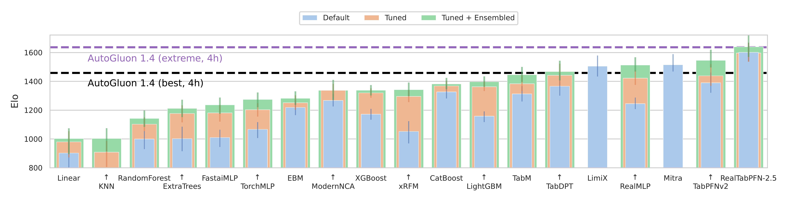
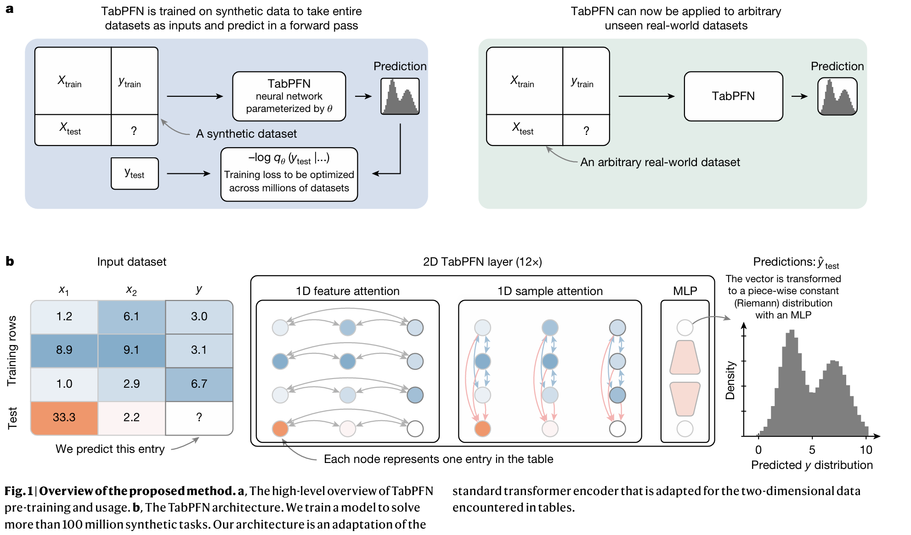
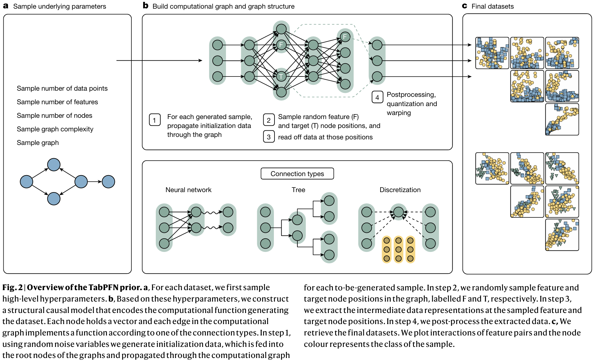

+++
title = '漫谈LLM时代的表格数据学习(TDL)'
date = 2025-12-08T16:27:51+08:00
draft = true
math = false
tags = []
+++

目前处在LLM时代，但是除了部分大规模稀疏场景（搜索/推荐/计算广告等）已经规模化DNN之外，大部分场景（中小规模数据集、工业医学生物等）的表格数据学习**Tabular Data Learning (TDL)**依然处在tree model的时代。在LLM广泛验证并使用的情况下，Tabular Data Learning是否能有一些新的突破？

首先，由于我本身是搜广推的背景，不由得思考一个已经被验证了的问题。为什么搜广推场景里面DNN有效使用并超过传统的xgboost/lightgbm/catboost，而其他的大部分Tabular Data场景似乎不那么有效？我认为主要原因主要是2点：

1. **搜广推场景的item/user极度稀疏**：这里的极度稀疏可以理解为一个category特征，one-hot的维度非常大，比如千万/亿。大的电商平台sku能达到几十亿，item embedding table相比tree model更容易表征item本身，而tree model很难针对每个item在tree上产生一个独立的分裂路径。而恰恰embedding在搜广推里面也是最重要的参数比重也是最大的，而tree model除非树的深度足够深，且确保学习过程中不同item刚好能分裂到不同的路径否则能难用一个独立的路径表达某个item；
2. **搜广推场景的数据规模足够大**：越大的数据规模，DNN的优势才会越明显；

而对于大部分场景的Tabular Data，两者似乎都不太能满足，我理解这也是DNN在很多Tabular场景不适应的原因。这个时候在回到TDL，那么它在LLM时代会有一些不一样吗？LLM时代对生成式搜广推的影响我准备回头单独整理一篇，这里主要想初略写一下它对通用TDL的影响。

## TabArena Leaderboard

首先先看一个Tabular Data的Leaderboard：https://huggingface.co/spaces/TabArena/leaderboard

AutoGluon是一个aws的一个自动化Tabular Data学习的库，它是一个Ensemble Model，通过Stacking的方式。而且其内部默认的集成模型会随着leaderboard的变化进行改变，这里作为一个基准。Leaderboard中可以看到一些有用的信息包括：
1. 有些DNN的Model通过一定的优化（Tuned）是可以一定程度超过传统树模型的，比如TabM、RealMLP等——可见DNN的参数调优依然很重要
2. **LimiX/TabPFNv2/RealTabPFN-2.5**是通过类似LLM的In-Conext Learning进行pretrain得到的模型，从这看，LLM时代的TDL也相应的有一些新的发展思路，初步效果看起来也还不错

## TabPFN

TabPFN是第一个也是最典型的一个用训练LLM的思路训练Tabular Data的模型。它通过在生成的数据上训练，对于新的场景，把trainset和testset作为context一次性给到模型，直接对testset进行打分输出。与一般我们理解的gbdt模式不同，gbdt是先在训练数据上训练，然后固定模型参数在预测数据上预测，模型的粒度是tabular data里面的一行。TabPFN是在很多生成的tables上训练，一个table是一个上下文，一旦预训练好，模型参数固定，在新的场景直接使用该模型而不需要继续训练。

模型结构上，除了在特征维度进行Attention，Sample和Sample之间也计算Attention。

由于模型是在生成数据上预训练，数据生成的过程和质量就尤其重要。它通过**Structural Causual Model (SCM)**生成具有因果关系的dataset。

PFN-2.5相比PFN-2：
1. 生成数据上：增加了生成数据的分布，扩大了生成的Table的样本和特征数量；
2. 模型结构上：变化不大，网络加深了
3. Real-TabPFN-2.5版本还在43 real-world tabular datasets上进行了post-training 

另外，Leaderboard里面的Limix与TabPFN结构类似，也同样是用生成数据做Pre-training。

## 关于大模型TDL的前景

那这种通过生成tabular数据预训练模型到底对TDL未来的影响如何，我觉得TabPFN模式是解决通用Tabular Data Learning场景目前我了解的一种最有效方式：

1. PFN-2.5的参数规模依然很小，才几百M——相比最新的LLM有很大的Scaling空间；
2. 数据规模（LLM里面是tokens数量）：原本没有具体说有生成多少个表格（数百万），TabPFN-2.5处理单次表格rows最大5000，特征最大2000，大概估算下data cells ~ 500M * 5000 * 2000 = 5*10^13，大概在GPT-3到GPT-4中间的Token量级，而且由于生成数据容易获取，还有比较大的空间；
3. TabPFN实验中可以看出，即使不针对使用场景的训练数据再单独训练，其效果依然可以达到和特定场景训练的模型相当的效果，说明模型确实生成数据中学到了一些data之间的相关性。如果加入持续增加真实场景的高质量数据，是不是效果会更好（v2.5中有对应的实验）

但它也有一些问题：

1. 由于采用的In Context Learning (ICL)方式，会做feature间和sample间的attention，预估的时候，需要一次性把场景的train data和test data喂给它，因此场景样本规模很难做到很大
2. SCM生成的数据质量与真实场景数据的差异，会严重制约模型的性能；而真实场景的数据受版权、格式等问题也不好搜集。

综上，我认为目前为止，对于万级别以下的数据规模，还是比较值得一试的，尤其可能比较适合医疗/生物等数据量少、搜集比较困难的场景。

但也回过头来看LLM，其实想想，人做LLM任务和CV任务本身是不是就比Tabular任务容易得多？那对于模型来说呢，它会更简单吗？
