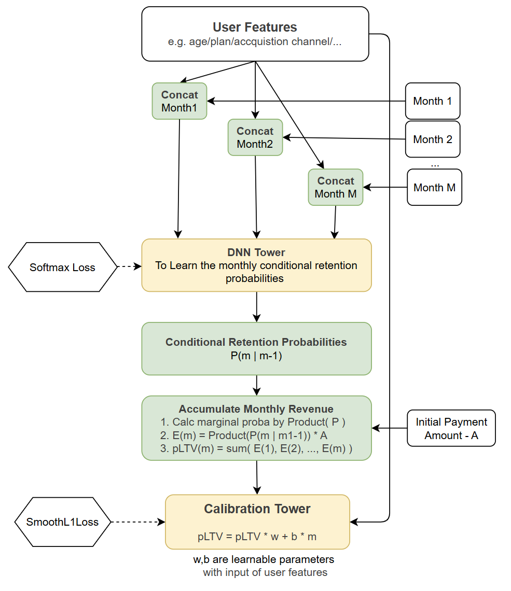

+++
title = 'LTV Prediction Model In Installment Scenarios'
date = 2025-09-24T12:58:00+08:00
draft = false
math = true
tags = ['ML']
+++

## 1. Background

In many businesses with recurring payments—e.g. installment plans, subscription services, financing, insurance renewals etc.—one key task is to estimate the _lifetime value_ (LTV) of a customer. In your setting, because the cash flows accrue monthly (or at some periodic cadence), you may want to estimate the **predicted LTV at the end of each month**, and potentially project out over a long horizon (e.g. 5 years). We call this **pLTV** (predicted lifetime value).

In particular, the goals are:

- At the end of a given month $m$, for each customer (or account) estimate how much future revenue (or profit, or commission) that customer will still bring in beyond month $m$. And we need to keep the monotonicity in the model, that a larger $m$ should predict higher LTV.
    
- The model should naturally incorporate _retention / dropout dynamics_ (i.e. customers may churn / no longer pay) as well as the varying per‐month revenue or commission contributions.
    

A naive approach is to separately model retention (the probability a customer continues to the next month) and then multiply by expected future revenue (a “two‐stage” approach). But that can lead to suboptimal performance, because retention and monetization are correlated and because error propagation can degrade the final pLTV estimate.

## 2. Related Works About PLTV

Below is a survey of typical modeling approaches for lifetime value / predicted LTV, especially in contexts where a substantial fraction of users churn (i.e. zero future value) and the nonzero-value portion is heavy-tailed.

### 2.1 Two-stage methods (retention → monetization)

A classical paradigm is:

1. **Retention / propensity model**: predict for each future period whether the user remains (binary classification or survival modeling).
    
2. **Monetization model**: conditional on continuing, predict the future spend or contribution (regression).
    
3. Multiply retention probabilities and monetization to get expected value.
    

This modular decomposition is intuitive and allows specialization of each component, but it has limitations:

- Errors accumulate: if the retention model misestimates probabilities, the monetization model cannot easily correct that.
    
- The two models are trained independently, which might ignore interactions between churn and spending behavior.
    
- It typically does not capture uncertainty across the two stages jointly.

### 2.2 One-stage model

To overcome error propagation and integrate churn + spend modeling, more recent approaches propose a _single model_ that jointly captures both dropout and the magnitude of future spend.

A prominent example is the [**Zero-Inflated LogNormal (ZILN)** loss](https://arxiv.org/abs/1912.07753), championed in [Google’s LTV modeling library](https://github.com/google/lifetime_value). They argue that (a) many customers never return (giving many zeros), (b) for returning customers the spend distribution is heavy-tailed, so MSE is poorly suited, and (c) the mixture model elegantly handles both regime types. The idea of the ZILN loss is: 
- The future LTV is modeled as a mixture of (a) a point mass at zero (for churners), and (b) a log-normal (or log-Gaussian) continuous distribution for non-zero spenders.
    
- Concretely, the model outputs both a _probability of churn / nonzero_ and conditional parameters (mean, variance) for the continuous component. The mixture negative log-likelihood forms the training loss.
    
- This jointly trains the churn probability and magnitude in a single unified framework, with shared representation. It tends to outperform separate modeling in practice.

Beyond ZILN, there are more recent advances in modeling uncertainty, long-horizon predictions, structured dependencies and scale/imbalance challenges:

- [_Customer Lifetime Value Prediction with Uncertainty_](https://openreview.net/pdf?id=aMJLcn2yTj): Proposes using **Monte Carlo dropout** to quantify predictive uncertainty in pure neural network LTV models, comparing with ZILN as a strong baseline.
    
- [_SHORE: A Long-term User Lifetime Value Prediction Model_ (2025)](https://arxiv.org/abs/2506.10487) introduces techniques to better model _long-horizon_ LTV by combining shorter-term auxiliary tasks and a hybrid loss that is robust to zero inflation and outliers.
    
- [_Billion-user Customer Lifetime Value Prediction (Kuaishou)_](https://arxiv.org/abs/2208.13358) introduces an **Order Dependency Monotonic Network (ODMN)**, which enforces monotonic dependency across different time-span LTV outputs, and a “multi-distribution multi-experts” module to handle imbalanced distributions.
    
- [_ADSNet: Cross-Domain LTV Prediction_(2024)](https://arxiv.org/abs/2406.10517) addresses the domain shift challenge when combining internal and external data sources, using a Siamese network and domain adaptation techniques.

And also some cases where applied pri-knowledge to modeling the LTV directly. For example, an `exponential` function or survival function, by given the input features $x$ and retention month $m$, the `exponential` function should like:
$$
f(m) = a \cdot \left(1 - e^{-bm}\right) + c + d m
$$
The model returns the _per-month forecasted revenue/commission_ for months 1..M as `output`, along with the latent coefficients. This `exponential` component can be viewed as a prior or baseline forecast of commission trajectories. But it suffers from the limitations of exponential pri-knowledge, where most of the scenarios are not satisfied.

## 3. Our Method

Our method builds on the principles of end-to-end learning of one-stage model but refered the 2 stage method in installment scenarios. The core idea is to model the fundamental, month-over-month survival process of a customer and use it to derive the full LTV curve. The model jointly learns retention probabilities and the resulting LTV in a single pass.

#### Model Architecture

The architecture is designed to make a unique prediction for each future month by combining static user features with dynamic temporal features.

The model's logic can be broken down into five key steps:

**Step 1: Modeling Conditional Retention Probability**

Instead of directly predicting survival at a distant month `m`, the model focuses on a more fundamental quantity: the probability of a customer surviving month `m` *given* they were active up to month `m-1`. This conditional probability, denoted as $p_m$, is modeled by a neural network $f_\theta$ that takes both static user features ($X_{\text{user}}$) and temporal features specific to that month ($T_m$) as input. The temporal features include the month's index and its seasonal characteristics (e.g., embeddings for the month of the year), allowing the model to capture time-dependent churn patterns.

$$ p_m = P(\text{Active at month } m \mid \text{Active at month } m-1) = \text{Softmax}(f_\theta(X_{\text{user}}, T_m))_1 $$

The softmax output provides the probability for the "retained" class.

**Step 2: Deriving the Marginal Probability**

With the sequence of conditional probabilities ($p_1, p_2, \dots, p_M$), we can calculate the marginal survival probability $S_m$—the overall probability that a customer is still active at the end of month $m$. This is achieved by applying the chain rule of probability, resulting in a cumulative product.

$$ S_m = P(\text{Active at month } m) = \prod_{i=1}^{m} p_i $$

This gives us a full survival curve for the customer, representing their declining probability of retention over time.

**Step 3: Calculating Expected Monthly Value**

In an installment scenario, the value generated in a given month, $V_m$ (e.g., a commission payment or subscription fee), is known. The *expected value* for that month, $E[V_m]$, is this value multiplied by the probability of the customer actually being active to pay it.

$$ E[V_m] = S_m \cdot V_m $$

**Step 4: Accumulating to get the pLTV Trajectory**

The pLTV at the end of any month $M$ is simply the cumulative sum of all expected monthly values up to that point. This calculation produces the entire LTV trajectory.

$$ \text{pLTV}_M = \sum_{m=1}^{M} E[V_m] = \sum_{m=1}^{M} \left( \left( \prod_{i=1}^{m} p_i \right) \cdot V_m \right) $$

This final output is a vector $[\text{pLTV}_1, \text{pLTV}_2, \dots, \text{pLTV}_{\text{max}}]$, providing the estimated cumulative value at each future month-end.

**Step 5: Optional Post-Hoc Calibration**

To further enhance accuracy and correct for any systematic biases in the model's predictions, we introduce a final calibration layer. A separate, small neural network (the "Calibration Tower") takes the original user features $X_{\text{user}}$ and learns two scalar values for each customer: a multiplicative weight ($w_c$) and an additive bias component ($b_c$). These are used to apply a user-specific linear transformation to the entire LTV curve.

$$ \text{pLTV}'_M = w_c \cdot \text{pLTV}_M + b_c \cdot M $$

This step allows the model to globally scale or shift the predicted LTV curve for a user, providing an extra degree of freedom to better fit the ground truth data. The weights and biases are constrained to be non-negative to ensure plausible financial interpretations.
