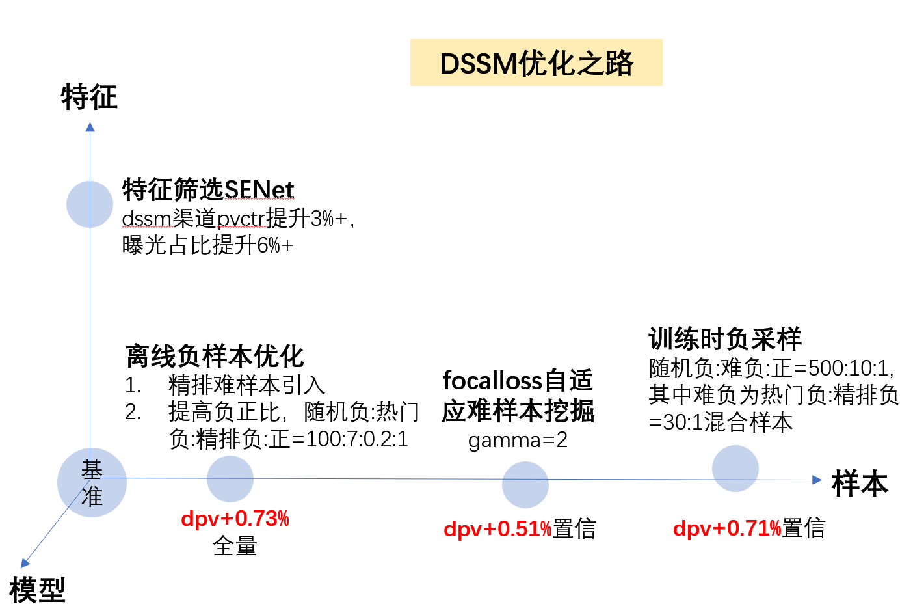
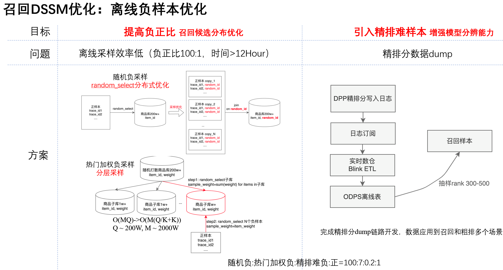
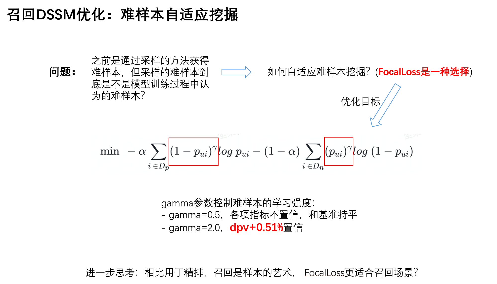
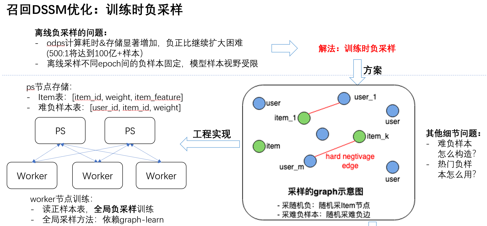
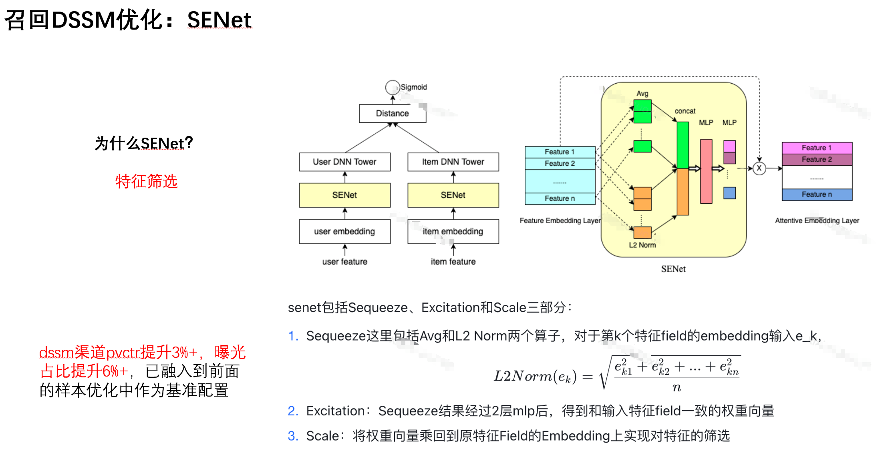

+++
title = 'Recap得物瀑布流双塔召回优化'
date = 2023-09-05T20:23:00+08:00
draft = false
math = true
tags = ['ML','Recommendation']
+++

## 背景

在得物做商品推荐期间，负责过一段时间的双塔召回优化，通过对负样本采用和难样本的优化，最终在保证其他指标不降的情况下DPV提升2%多。本文主要记录一下当时的一些优化思路和策略。

## 路径

### 离线负样本优化

在我刚接手的时候，看到了一些问题：

- 双塔召回的负正比只有10:1，显然对于召回来说这个负正比太低了。当时所有的采样都是在ODPS（大数据处理平台）+ Python UDF进行的，要更高比例负样本的采样，效率是一个很大的问题。针对这个问题，我通过移除Python UDF，利用ODPS SQL的分布式能力，另外通过分层采样的方式将负正比提升到了100:1；
- 另外，难负样本只采了热门负样本，为了让召回能更好的适应精排过程，通过把精排尾部（rank 300-500）的样本采样进来，提升模型对难负样本的区分能力，为此顺便还把精排打分的Flink同步任务也搭建了起来。

### 难样本自适应

都说召回是样本的艺术，上面的操作通过从热门负 和 精排结果的负样本中人工挖掘了难负样本。但有没有办法让模型自己去发现难负样本呢，以及我们认为的精排负难道就一定是模型认为的难样本吗？基于此出发点，自然联想到了Focal Loss，通过gamma参数，Focal Loss能增强对难样本的学习。这里值得注意的是，gamma参数非常重要，可能需要通过一些实验来调整gamma参数。一般为了增强难负样本的学习，gamma会设置成一个稍微大一点的值。

### 训练时全局负采样

前面**离线负采样优化**已经将负采样比例从10:1提升到了100:1，但随着这个比例继续增加，odps消耗的计算以及存储成本显著增加。另一个问题是离线负采样的负样本经过采样后就固定了，模型的视野受限。有没有办法，在训练时采样，既不用离线存储大量负样本，又能让模型看到更多样的负样本呢？我主要通过[graph-learn](https://github.com/alibaba/graph-learn)来实现的，主要：

1. 将user-item建异构图，维护3张表：user-item交互正样本、item表、难负样本表（热门+精排尾部）；
2. 训练时采样：通过graph-learn，训练时从graph中采样负样本，控制item的采样比例和难负样本的采样比例。达到更高的负正比。

### SENet

这个是个模型上的技巧，基本大家都知道的技巧。为了更高效的做特征交互，CV领域的SENet，开始在微博推荐中使用拿到了效果，后面很多其他大厂模型中也开始有使用。很多时候通过SENet，还能更好的分析DNN模型中的特征重要性。

## 总结

通过以上的优化手段，最终在保证其他指标不降的情况下，在DSSM召回曝光占比只有百分之十几的情况下，DPV提升了2%多，还是很可观的。这里面样本的优化相比模型结构的优化是更重要的。希望本文能给大家在双塔/多塔召回优化上带来一些思路。
