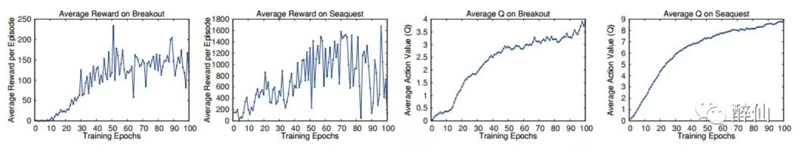
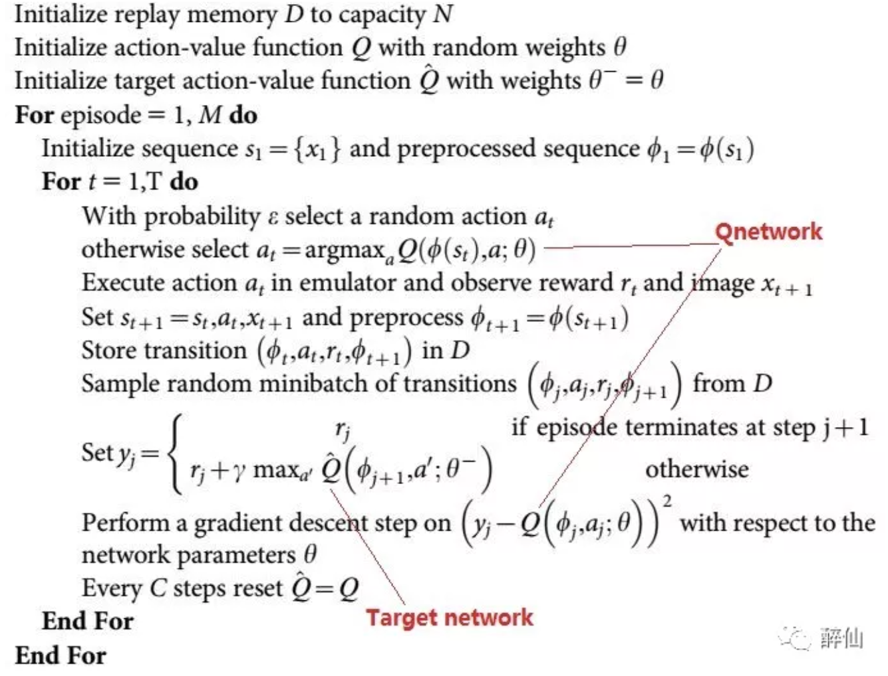
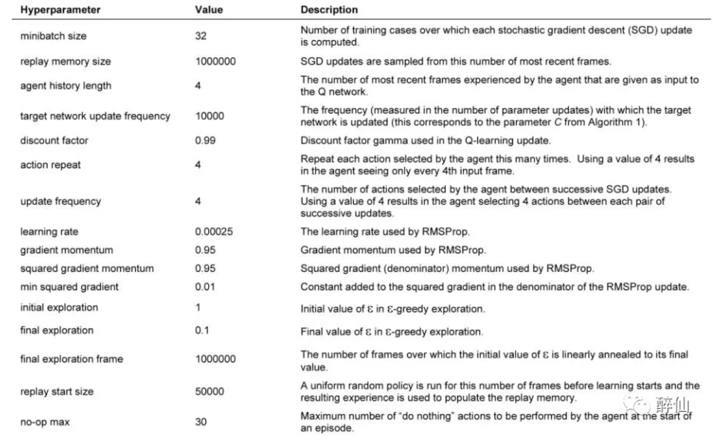
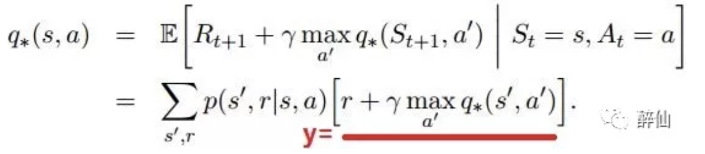
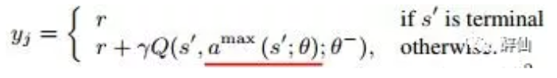
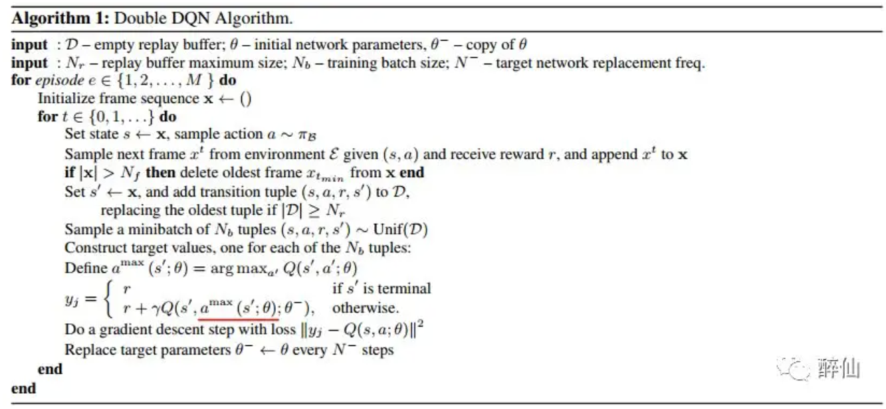
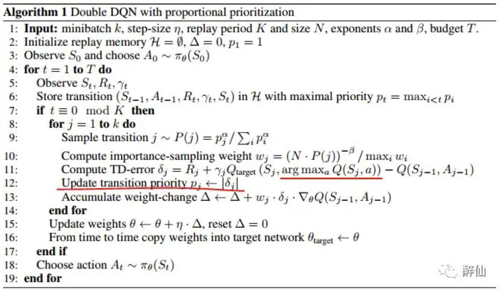

+++
title = 'Rethinking DQN'
date = 2019-03-22T19:47:48+08:00
draft = false
math = false
tags = ['RL']
+++

原文来自自己很早前写的一篇公众号文章：[Rethinking DQN](https://mp.weixin.qq.com/s/10ckZDC9IY6mMXr9mk6GJQ)

## Playing Atari with Deep Reinforcement Learning

为什么增加Replay Memory有效？

* 一个样本可能被多次随机采样到，在多次权重更新中被使用，多次学习，局部策略学习更有效
* 直接学习连续的游戏帧样本，前后帧之间存在强的相关性，从memory中随机采样打破了这种相关性
* Replay Memory相当于使用Replay Memory长度时间的behaviour分布，避免使用当前时刻behaviour出现震荡和局部最优

针对第3点，避免陷入局部最优和震荡的情况（比如陷入 往左->update Q->max Qaction->往左 这种局部循环），Replay Memory需要使用off-policy的策略，所以选择Q Learning

* on-policy: when learning on-policy the current parameters determine the next data sample that the parameters are trained on
* off-policy: current parameters are different to those used to generate the sample DQN中因为要积累batch，使用Experience Replay，所以是典型off-policy的

DQN输入预处理方法：

* RGB -> GrayScale
* resize，然后切掉游戏背景的黑边，最后size从(210,160)变成(84.84)
* 使用最近的4帧作为输入，因此输入为4x84x84

关于Reward：

* 由于原文准备在不同的游戏上使用相同的架构和学习参数，所以把正reward都设成1，负reward都设成0，0 reward不变。用这种截断reward的方式，限制了error的范围，从而可以使用相同的学习率参数
* 上面这种截断reward的方式对性能有一定的影响

优化方法：

* RMSProp with batchsize=32
* e-greedy的阈值概率：前面100 0000(1 million)帧从1到0.1线性变化，后面帧保持0.1不变
* Replay memory的大小：最新的1 million帧
* frame-skipping technique

怎么看训练结果好坏，训练时要打印什么东西观察收敛情况？

* the total reward the agent collects in an episode or game averaged over a number of games，即每个episode（每一局）的reward变化。该度量方法结果会存在很大的noise或者说震荡，比如下面的左边两张图
* 更稳定的度量方式是：the policy’s estimated action-value function Q, which provides an estimate of how much discounted reward the agent can obtain by following its policy from any given state。如下面的右边两张图，即Q*

## Human-level control through deep reinforcement learning

在上一篇的基础上改进：target network和Qnetwork使用不同的参数

大部分处理方式和上篇文章一样，增加了1点：

* error term clip：error截断到-1到1之间。这种处理的效果类似于使用了加绝对值的loss函数 思考：使用HuberLoss是不是可以起到限制loss发散的效果？

另外，这篇文章附录部分有一个表格描述使用的参数，实训过程可能有参考价值，

## Deep Reinforcement Learning with Double Q-learning

DQN里面的核心其实是Q网络的标签y计算的问题，而y的计算是通过Bellman公式得到的。 最早的Bellman公式其实是计算期望（从某个状态s可切换到多个下一状态s'），

但在Nature和Atrai文章中，因为都是使用s'中的某一个样本来训练，即(s,a,s',r)四元组，所以 y的计算就变成上面划横向的部分。 Bellman公式很容易理解：预测从下一状态开始到结束q(s,a)，就是从s->s'的reward+下一状态之后的最大q(s',a')

在DQN中这里的q都是是使用target net计算的

DDQN则实际上是对上面公式的改进。DDQN认为Bellman中直接使用target net计算下一(s',a')的q，容易与y耦合。因此改成online的Qnet来选择下一状态action计算Q

注意上面的θ和θ-分别代表oneline network和target network。

## Prioritized Experience Replay

比较于DDQN，PER改进Experience Replay

原文根据TD-error给结果一个抽中的概率，从下面算法看，TD-error的计算跟DQN中loss的计算基本一致

