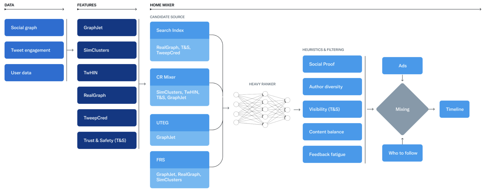
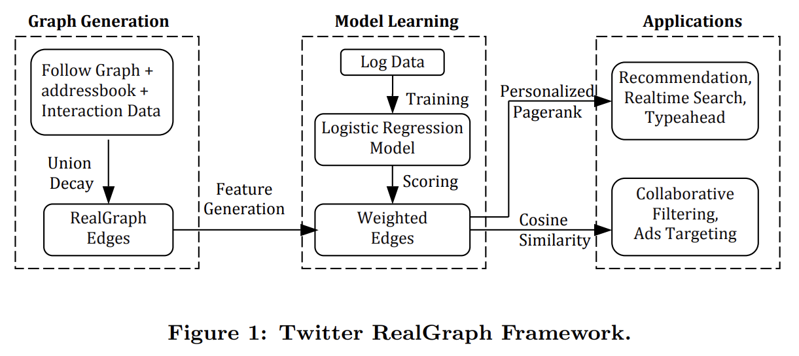
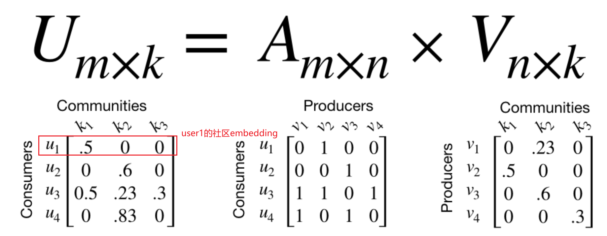
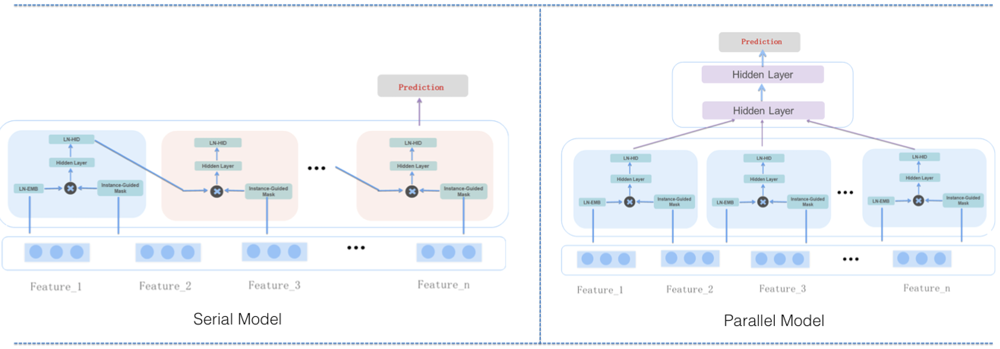
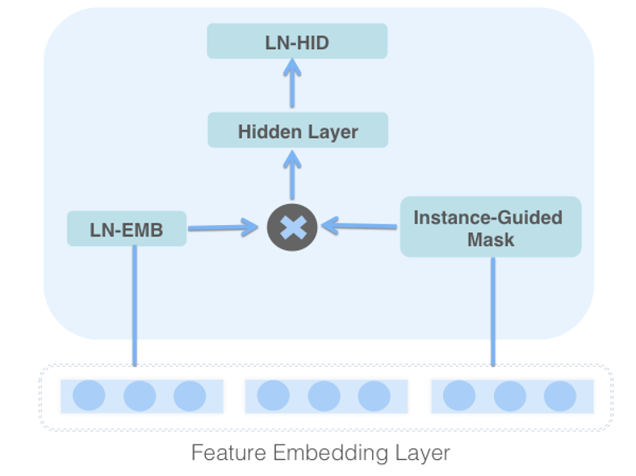

+++
title = 'Twitter推荐系统概览'
date = 2024-10-11T10:59:01+08:00
draft = false
math = false
tags = ['Recommendation']
+++

Twitter去年开源推荐系统代码到现在一年多了，一直没时间去看一看，今天想起来瞄了会，本文简单记录下。

开源：
- 系统代码：https://github.com/twitter/the-algorithm
- 算法代码：https://github.com/twitter/the-algorithm-ml
- 博客：https://blog.twitter.com/engineering/en_us/topics/open-source/2023/twitter-recommendation-algorithm

我先读的博客，基本了解其推荐系统的概况，总体来说，算法相比国内阿里电商首猜/小红书feed流的推荐是更初级很多。

整个系统基本就是召回 + 精排，可以理解没有粗排，在In-Network召回时也就是RealGraph那里会有一个LR模型类似粗排的功能。

# 数据：

因为Twitter是社交app，所以：
1. 主要是用户交互数据，包括用户-用户Follow的社交图，Tweet engagement通常指用户和内容的的交互，比如点赞、分享、关注等等；
2. 用户的profiles数据：语言、地理位置等

# 召回

召回是本次开源里面的重头部分。Twitter召回包括In-Network的召回和Out-of-Network的召回。In-Network指从用户的Follow用户的内容中召回，Out-of-Network指从未Follow的其他用户中召回，两者占比大概各50%。召回最终返回1500个候选集给到精排（Twitter叫Heavy Rank）打分排序。

## In-Network召回，占比50%

从Follow的用户中召回所有的内容，然后通过一个LR模型对这些内容进行排序。这部分叫[Real Graph](https://www.ueo-workshop.com/wp-content/uploads/2014/04/sig-alternate.pdf)，看了下这个是2014的工作了，博客中也提到要对LR模型重构。

RealGraph核心逻辑就是构建User间的有向图，然后通过LR学习Edges的权重，权重高的用户的内容多推荐一些。

## Out-of-Network召回，占比50%

包括直接从U2U2I召回、Sparse Embedding召回、Dense Embedding召回。

**U2U2I召回**：即从关注的用户喜欢的内容中召回，占比15%。有个问题，这里如果U2U2I内容数量超过15%怎么截断呢？

**Sparse Embedding召回**：也是U2U2I，只不过是通过Sparse Embedding找相似用户。首先通过[SimClusters](https://github.com/twitter/the-algorithm/blob/main/src/scala/com/twitter/simclusters_v2/README.md)社区发现算法，找到用户的社区representation embedding，然后通过ANN找到相似用户。

Sparse Embedding可解释性强，虽然Sparse Embedding从技术上来说是相比下面的Dense Embedding简单，但是基本所有的公司都还是会保留该路召回的。

**Dense Embedding召回**：相比用社区向量表征用户，Dense Embedding采用了[TwHIN](https://github.com/twitter/the-algorithm-ml/blob/main/projects/twhin/README.md)模型学习用户的向量表征，得到的向量结果可用于其他模型作为特征。

TwHIN思路和其他的U2U/U2I召回算法类似：
- 正样本：和目标用户有engagement的用户作为正样本
- 负样本：[batch内采样负样本](https://github.com/twitter/the-algorithm-ml/blob/b85210863f7a94efded0ef5c5ccf4ff42767876c/projects/twhin/models/models.py#L57)
- 优化：通过`binary_cross_entropy_with_logits` loss函数train一个Model。模型离线Train完之后，离线存储user vector，然后线上通过ANN索引查找最相似的用户。

采用的Graph数据：提到了大致是类似于"User follows User" "User favorites Tweet" "User clicks Advertisement"，但是由于隐私原因没法公开数据，由于存在不同的关系类型，所以TwHIN应该是训练的异构图，数据格式是：`左节点id, 关系类型，右节点id`。

工程上，TwHIN采用了pytorch开源的torchrec来实现该算法，torchrec适合高维稀疏特征的场景，也被用在Meta自己的DLRM的模型训练中。

召回里面的算法其实都比较中规中矩，没有很fancy的模型，对于图模型训练感兴趣的可以研究下TwHIN的详细代码。除了算法上，召回会有很多工作在推荐工程上，比如设计GraphJet去维护user-tweet-entity-graph (UTEG)即用户的交互图，比如follow-recommendation-service (FRS)推荐服务的工程实现等等。有兴趣的可以深入研究下twitter的工程实现，比如:
- 相似性检索，user/item embedding的存储，ANN的实现
- 图数据的存储
- 训练的规模和配置等等。

# 精排

召回的1500个候选送到大概48M参数的[MaskNet](https://github.com/twitter/the-algorithm-ml/blob/main/projects/home/recap/model/mask_net.py)中打分。国内的推荐系统，通过各种工程优化，中等公司一般也能做到差不多3000左右了，所以twitter进到精排的量并不算太大。

[MaskNet](https://arxiv.org/abs/2102.07619)是微博21年发表的一篇paper，其主要是为了解决输入特征（尤其是特征交叉）学习不充分的问题，作者也[说过](https://www.zhihu.com/pin/1625914601194958848?native=0&scene=pin_moments)，MaskNet是微博摸索过的几个模型里面（FiBiNet,GateNet,MaskNet,ContextNet）综合效果最好的一个。MaskNet由多个MaskBlock构成，多个MaskBlock可以组成Serial Model或者Parallel Model的形式。Parallel其实就是输入Embedding经过多个不同的特征权重计算后concat起来，最终输入DNN的Embedding维度会变成N倍。

对于每个MaskBlock，它的输入都是全量的Embedding，计算方式大概如下，
1. LN-EMB：计算Embedding的Layer Norm，$LN_{EMB}(Vemb)=concat(LN(e_1),LN(e_2),..,LN(e_f))$, 对于Parallel Model，其中Vemb都是原输入Embeddings=$[e_1,e_2,...,e_f]$，而对于Serial Model，第二个MaskBlock之后就是上一个MaskBlock特征加权后的输出；
2. Instance-Guided Mask:
    - Mask计算：2层全连接层，$𝑉𝑚𝑎𝑠𝑘 =𝑊_2(ReLU(𝑊_1*𝑉𝑒𝑚𝑏 + b_1)) + b_2$，注意Vmask的输出维度是F X K，F是特征Fields数量，K是每个Field的Embedding数量。所以输入Embedding的每个元素的mask weight都不同，而不只是每个Field不同。
    - Mask输出：$Voutput=ReLU(LN(W_i(Vmask⊙𝐿𝑁_{𝐸𝑀𝐵}(V𝑒𝑚𝑏))))$，Vmask点乘LN-EMB，再经过一个线性层+LN+ReLU输出。几个点，一个为什么这里Vmask没有像Attention一样softmax归一化？第二个，输出这里的线性层只有一个weight没有bias项？

# 重排和混排

重排就是一些基于业务的规则和策略，主要就是过滤和打散操作：

- 过滤：个人感觉这个有些应该放在召回前？
    - 看过的内容
    - 用户设置mute的作者和内容
    - 屏蔽成人内容等
    - 用户负反馈内容降低得分
    - Out-Of-Net渠道，排除与推文没有二度关系的内容以保证推文质量，也就是说推的内容要不就是关注的人有过互动，要不就是关注的推文有互动的用户。这条能保证推荐的结果可解释性强，但是会让整个推荐相对保守。
- 打散：
    - 同一作者的内容打散排布
    - 不同召回渠道的内容分布相对均匀，比如In-Network和Out-Network的内容占比相对平衡
- 正在编辑的tweets前置
- ...

混排的话：主要就是插入广告、其他非主推场景的产品插入（比如，除了主推tweet流，还有Follow推荐等等）。

好了，感觉就是这些，有时间再细看下代码。
