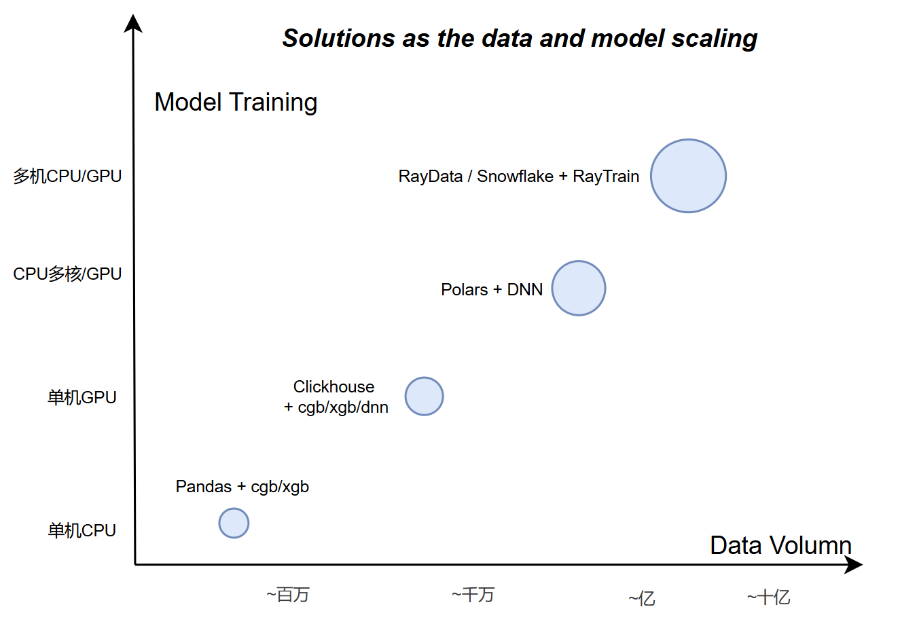
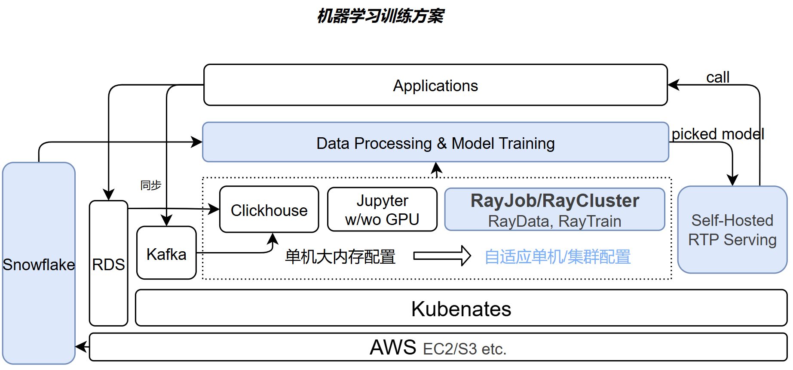

+++
title = '小企业机器学习模型训练实践——从单机Pandas到Ray的迭代'
date = 2025-10-20T10:55:30+08:00
draft = false
math = false
tags = ['ML']
+++

在大公司里通常有专门的团队负责机器学习平台与基础设施（例如在阿里，数据预处理常在 ODPS 完成，训练跑在 PAI/XDL 上）。但在小公司里，特别是那些没有自建完善数据流水线的团队，做模型就没有那么顺利：需要自己摸索如何加速特征生成、在单机上处理与训练上亿样本而不爆内存，以及如何在需要时平滑迁移到可维护的分布式方案。本文基于在 Jerry.ai 的实践，记录了从单机到分布式、从 Pandas/ClickHouse 到 Polars/Ray 的演进思路与经验总结。

## 背景

我们的原始数据以应用产生的表格为主，且常包含大量 json/xml 等复杂字段，提取与清洗这些字段需要较复杂的 SQL/ETL 逻辑。典型训练场景包括推荐、LTV 预估、价格预估及若干分类任务等。

在架构上，公司采用 Kubernetes + ClickHouse 做数据分析报表，数据由应用先落到 RDS，再同步到 ClickHouse，因此绝大多数离线特征构建是从 ClickHouse 出发。早期的机器学习流程通常是：在 ClickHouse 做查询、用 Pandas 做预处理、在 Jupyter/单机上训练模型。

与大公司相比，中小企业（如样本规模 < 1 亿）面临的特点和挑战主要有：
1. 初期分布式不是刚需——单机能解决大部分问题，工程成本和维护成本更敏感；
2. 随着数据增长，预处理首先成为瓶颈——一方面是耗时，另一方面是内存不足导致容易 OOM；
3. 当数据继续增长到千万/亿级，单机难以支撑快速迭代与模型实验，这时需要引入更高效、易维护的分布式数据处理与训练框架。

## 从单机到Ray的迭代

上图展示了随模型与数据增长的方案迭代路径，下图是我们最终的训练架构示意。

#### 第一阶段
当样本规模增长到百万级，pandas 在预处理上开始吃力、内存压力大。我们把尽可能多的特征预处理下沉到 ClickHouse，从而显著提升样本生成效率并降低单机内存压力。

#### 第二阶段
随着规模继续增长，单节点 ClickHouse 出现的局限开始暴露：
- 单机版本容易 OOM、需要重跑或分批计算；
- 复杂的特征变换常需编写 UDF 或写长 SQL，离线预处理代码难以复用、维护成本高。

为此我们引入了 Polars，我强烈推荐使用Polars：
- 从 eager DataFrame 迭代到 LazyDataFrame，实现更接近流式的处理，能在内存受限时减少 OOM；
- Polars 在常见场景下相比 pandas 提升显著（常见为数十到百倍），大部分场景下也优于 ClickHouse，因而很适合中小团队用于数据预处理。

在此阶段，我还特地写了个[Polars做Feature Transformer的通用代码](https://github.com/xiahouzuoxin/torchctr/blob/main/torchctr/transformer.py)，通过对多核的充分利用，相比pandas提升接近100倍。

在模型训练方面，进入千万级样本后我们采用基于批次的 DNN 训练，常见选项：
1. GPU：训练速度快，但对稀疏高维 embedding 的利用率偏低，GPU 内存也可能成为瓶颈；
2. 多 CPU：更能利用稀疏/高维特征的特性，整体利用率高但训练速度相对较慢。

在这一阶段，使用 PyTorch 在单机上能满足绝大多数训练需求，多卡训练也能通过 `torch.distributed` 或者 `accelerate` 等工具实现。

#### 第三阶段
当数据规模上升到亿级或更高时，单机计算与内存成为不可接受的瓶颈：
- 我们把训练从单机 PyTorch 迁移到 Ray Train。选择 Ray 的原因是其良好的扩展性与最小的代码改动成本——单机代码可以较平滑地迁移到集群，同时Ray对xgboost/lightgmb/pytorch等主流框架均有良好支持；
- 特征变换逐步迁移到 Ray Data，以支持分布式、高性能的数据处理，同时保持训练与部署的一致性；
- 原始数据的离线处理，主要是对json/xml等原始数据的ETL，也逐步从Clickhouse迁移到 Snowflake（主要因为由数据工程团队也受到OOM影响开始使用Snowflake），从而在这个阶段完全脱离对Clickhouse的依赖（Clickhouse本身也更适合做Report数据生成，而非大规模的数据生成）。

总结：我们先用更高效的单机工具（ClickHouse / Polars）实现单机上的效率提升，当样本与计算需求确实超出单机能力时，再用 Ray（Ray Data + Ray Train）实现平滑放大与可维护的分布式训练。

## 为什么没有选择其他方案

市面上有不少分布式数据处理与训练框架，例如 Spark、Hadoop 等。我们最终选择 Ray 主要基于以下考虑：

- 公司内部的整体数据架构一开始都是基于clickhouse，与HDFS/Hadoop的生态有一定差异；
- Ray 提供了较为统一的分布式计算框架，既支持数据处理（Ray Data），也支持模型训练（Ray Train），且对多种主流机器学习框架均有良好支持；
- Ray 的学习曲线很低，部署比较容易，且单机到集群的迁移成本较低，适合中小团队快速上手与迭代。
