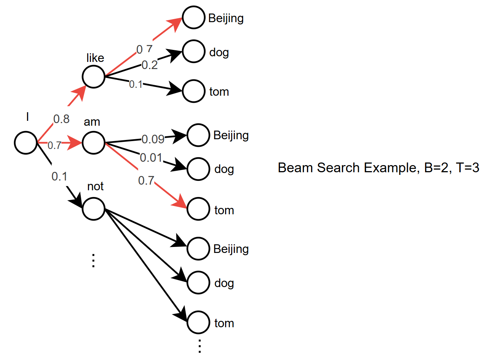
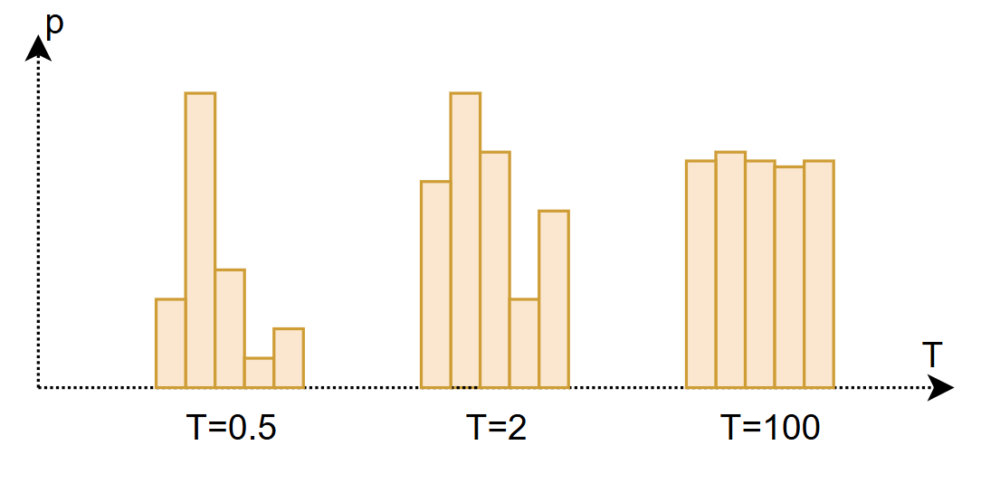

+++
title = '控制模型创造力的艺术——LLM Decoding策略解析'
date = 2024-07-05T10:55:30+08:00
draft = false
math = true
tags = ['Machine Learning', 'LLM']
+++

## 什么是Decoding策略

在使用GPT类产品的时候，不妨问一下自己这些问题：
- 同一个 prompt，为什么模型有时说的不一样？
- Chatbot里面的Temperature参数是什么含义？为什么说值越大越有创造力？
- 如果我想让输出100%确定，应该怎么做？

LLM的输出是vocab维度的预测概率分布，$P(x_t | x_1, x_2, ..., x_{t-1})$, 在预测阶段，需要根据这个概率分布生成文本序列，解码（decoding）策略是从模型预测分布中**选择下一个 token** 的过程。

模型输出的 logits 通过 softmax 转化为概率分布：

$$
P(x_t | x_{<t}) = \frac{e^{z_t}}{\sum_j e^{z_j}}
$$

针对这个概率分布的输出，选择下一个token的策略总体上分为：

- **确定性策略**：
	- Greedy Search: 每步选概率最大的 token，结果是确定的。$x_t = \arg\max P(x_t | x_{<t})$ 
	- Beam Search: 综合考虑所有候选序列，选择概率最大候选序列，结果也是确定的
- **Sampling**：根据概率分布随机采样
	- Top-k:
		- 只保留概率最高的k个 tokens，$S_k​={x_i​:x_i​ \in TopK}$
		- 对候选集合重新归一化再采样，$x_t​∼Categorical(S_k​)$ 
		- Top-k可以避免非常荒谬的输出
	- Top-p（_Nucleus Sampling_）: 
		- 保留累计概率 ≤ p 的最小 token 集合
		- 可以动态调整候选集大小，比Top-k更灵活
	- Top-k/p with Temperature: softmax计算中通过引入temperature参数控制输出的分布（更尖锐 还是 更平缓）

确定性策略和Sampling侧略也可以结合使用，比如Beam Search得到TopK的Sequence，然后根据概率分布随机采样。

## Beam Search
### 动机

在 生成式模型（如语言模型、推荐生成、机器翻译）中，我们往往要生成一个 token 序列：
$$
y_{1:T}=(y_1,y_2,\dots,y_T)
$$

模型给出条件概率：
$$
P(y_{1:T} \mid x) = \prod_{t=1}^{T} P(y_t \mid y_{1:t-1}, x)
$$

目标是找到：
$$y^* = \arg\max_{y_{1:T}} P(y_{1:T} \mid x)$$

但是：

- 所有序列的组合的搜索空间非常大（指数级），无法穷举。
- Greedy Search（每步选最大概率的 token）虽然快，但容易错过全局最优序列。

于是可以使用 **Beam Search** —— 一种在 “搜索效率” 和 “全局最优性” 之间折中的方法。

### Beam Search计算步骤

设：
- beam 搜索宽度为 B
- 序列最大长度为 T

算法每一步保留 概率最高的前 B个候选序列（beam），扩展它们的下一个 token，并继续筛选。

**初始化**
在时间步 t=1：
$$\text{Beam}_1 = \text{TopB}\big( P(y_1 \mid x) \big)$$

即保留概率最高的前 B 个 token。

**递推过程**

在时间步 t>1：
1. 对每个当前 beam（长度为 t−1的部分序列）扩展所有可能的下一个 token：
$$\text{候选集合} = \{(y_{1:t-1}^{(b)}, y_t) \mid b=1,\dots,B,\; y_t \in V\}$$
2. 对所有候选计算累积 log 概率（为什么用log add？因为如果采用概率乘的方式有可能导致数据进度溢出问题）：    $$\log P(y_{1:t}) = \log P(y_{1:t-1}) + \log P(y_t \mid y_{1:t-1}, x)$$
3. 从这些候选中选出前 B 个最高概率的序列，作为新的 beam：
$$\text{Beam}_t = \text{TopB}\big(\log P(y_{1:t})\big)$$
4. 如果某个 beam 生成了 EOS（结束符），则将其从活跃 beam 中移除，放入完成候选集中。

**终止与选择**

到达最大长度 T 或所有 beam 都以 EOS 结尾时，选出完成候选中概率最高（或长度归一化后最高）的序列。

## Top-p/Top-p Sampling with Temperature

Temperature开始是在Hinton的蒸馏模型中出现，通过temperature参数可以控制输出分布的差异化程度。T越小，输出的概率分布越尖锐，否则T越大输出分布越平缓。

原理是在logit计算softmax的时候，增加温度参数T，做温度缩放：

$$
P(x_t | x_{<t}) = \frac{e^{z_t/T}}{\sum_j e^{z_j/T}}
$$

Temperature通常结合Top-k或Top-p得到最终的输出序列，最终的效果是，
- T>1：分布更平缓，增加随机性（更“创造”）；
- T<1：分布更尖锐，更确定；
- T=1：原始 softmax；
- T趋近0：接近贪心解（总是取最大概率 token）。
- T趋近无穷大：接近随机输出

## 参考

- **Sutskever et al. (2014)** — _Sequence to Sequence Learning with Neural Networks_， 最早展示 Beam Search 在 Seq2Seq 模型中的应用。
- **Vaswani et al. (2017)** — _Attention Is All You Need_，Transformer 架构奠定了解码策略的重要性。
- **Holtzman et al. (2020)** — _The Curious Case of Neural Text Degeneration_，提出 Top-p (Nucleus) Sampling，解释为什么 Beam Search 会导致退化。
-  **Li et al. (2016)** — _Diverse Beam Search: Decoding Diverse Solutions from Neural Sequence Models_，提出 Beam Search 多样性改进。
- **Keskar et al. (2019)** — _CTRL: A Conditional Transformer Language Model for Controllable Generation_，实践中使用 temperature + top-k 控制生成质量。
- [如何让大模型生成解码阶段的结果更好：从Beam Search到top_k、top_p等参数的实现原理与脚本实现](https://mp.weixin.qq.com/s/IswrgDEn94vy5dCO51I1sw)
