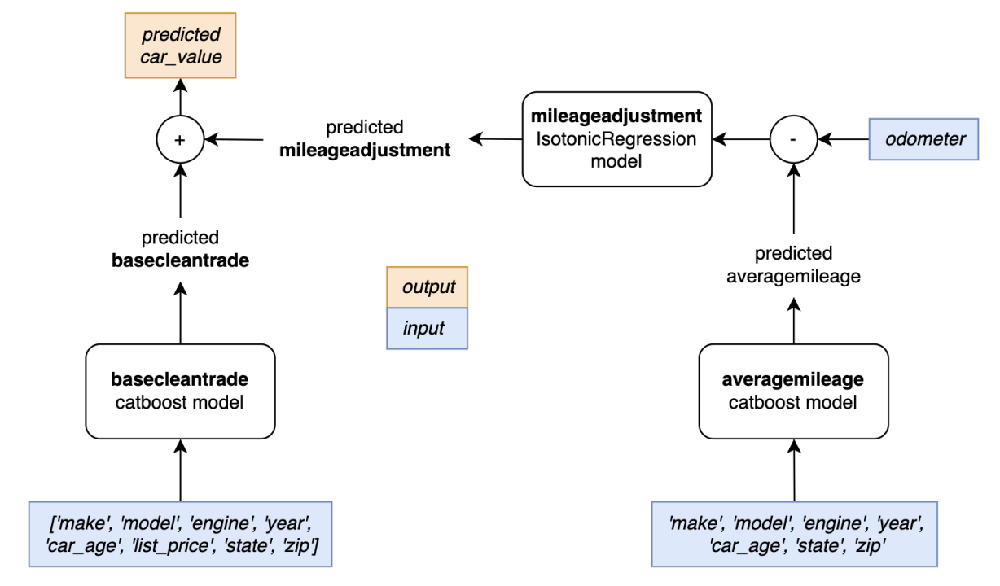

+++
title = '机器学习建模——如何融入先验信息'
date = 2024-05-05T20:23:00+08:00
draft = false
math = true
tags = ['Machine Learning','Uplift']
+++

# 背景

想要用ML模型拟合业务，但实际中经常会遇到类似下面的场景：

- 二手车价格预估：同一辆车，预估的价格与里程应该是严格负相关的；
- 保费预估：保额越高，保费越高；
- 理财产品中，比如余额宝，用户的利率敏感度预估（利率敏感度=用户余额变化/利率变化）：同一用户，理财产品利率越高，购买金额越高，余额越高；

如果直接用比如xgb或dnn模型拟合 X -> Y，

$$
p_y=f(x), where\ x = [x_c, x_p]
$$

其中f为xgb或dnn等具体模型，x_c为先验无关的特征（比如二手车里面的品牌和里程特征无关），x_p为先验相关的特征。由于噪声数据的存在以及模型中没有任何的相关性约束，模型最终的打分输出很难保证满足上面案例中的约束关系。

# 自然想到的方法

一种自然想到的方法是，将f拆解成2部分：

$$
p_y=f_c(x_c) + f_p(x_c,x_p)
$$

其中：

- $f_c$主要建模先验无关特征，可以是任意复杂模型，其输入只能是$x_c$；
- $f_p$单独建模先验信息，必须是满足先验约束的模型，一般是满足单调性的模型，比如LR、[IsotonicRegression](https://scikit-learn.org/stable/modules/generated/sklearn.isotonic.IsotonicRegression.html)等，其输入包含$x_p$；

根据这个思路，二手车价格的建模就可以表达为：predicted car_value = 基础平均价格（baseclean_trade） + 里程相关的价格（predicted mieage_adjustment）。

这种方法建模有个问题，数据集怎么构造？针对二手车预估这个问题，标签一般只有最终的车价，basecleantrade model和averagemileage模型的标签怎构造呢？

- basecleantrade model：除里程相关特征（odometer，mileage等）外，其他特征group by计算平均价格作为标签，即同款车在不同里程下的平均价格作为标签；
- averagemileage：里程特征的平均作为标签，其他特征作为模型的输入；

从数据构造过程也可以看出，要采用这种方法的话，就一定得保证同款车有多个不同里程下的数据，这样效果才会好。

# 进一步——End2End

上面需要建模多个模型，是否能把多个模型融合做到End 2 End训练呢？答案是在DNN中加入先验信息。

同样对于二手车价格的建模，如下图，可以在DNN中针对里程这一项加入先验约束（mileageadjust module）。

图里画的是线性约束，当然，线性约束效果最中预估效果上可能会有一点折扣，可以考虑survival/cox function作为先验约束函数能达到更平滑的效果。具体用什么约束函数，是通过数据分析得到的。

根据这个思路，如果我要预估理财中的用户利率敏感度可以怎么做呢？把上面的思路顺一顺：

1. 分析历史数据中“利率变化"和“余额变化"的关系，如果是接近线性，那就可以用线性先验，如果只是单调则可以考虑survival/cox function；也可以结合一些业务/经济规律来定义先验，比如[需求价格弹性](https://zh.wikipedia.org/wiki/%E9%9C%80%E6%B1%82%E7%9A%84%E4%BB%B7%E6%A0%BC%E5%BC%B9%E6%80%A7)；
2. DNN建模，在模型中加入步骤1中得到的先验约束；

最终，利率敏感度建模可以类似下面这样（先验有点类似于需求价格弹性先验）。其中$Q_t$是用户在t日的余额，$r_t$是产品在t日的利率，$Q_{t->t+N}$用户余额变化，$x_{t^+}$是用户利率变化，模型训练完后的$E_d$即可输出作为利率敏感度。

# 扩展

其实了解过uplift因果模型的同学，应该很容易发现这里的建模方式和uplift中的s-learner很像，只是s-learner中一般treatment是二元变量，但是这里例子中的变量（比如利率，里程等）是连续型变量。

所以要继续深入可以研究将uplift中的方法引入到先验建模场景中。
