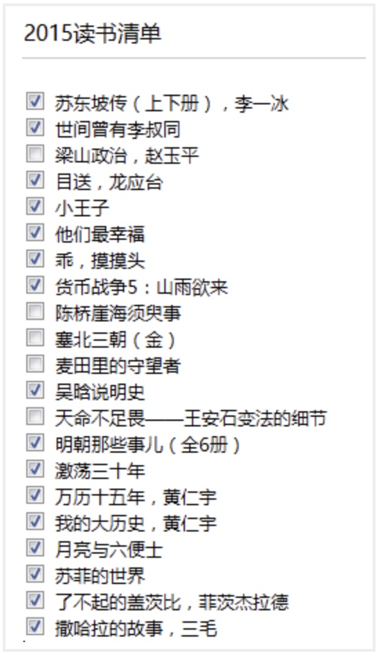

+++
title = '毕业季读过的那些书'
date = 2016-01-02T07:19:37+08:00
draft = false
+++

> 这些年我一直提醒自己一件事情，千万不要自己感动自己。大部分人看似的努力，不过是愚蠢导致的。什么熬夜看书到天亮，连续几天只睡几小时，多久没放假了，如果这些东西也值得夸耀，那么富士康流水线上任何一个人都比你努力多了。人难免天生有自怜的情绪，唯有时刻保持清醒，才能看清真正的价值在哪里。
>
> ——于宙TEDx演讲：我们这一代人的困惑

平时总拿追求安逸平凡作为生活的目标，其实是给自己懒惰找的借口而已。为什么要读书，下面是在知乎里看到的答案，

> 我读过很多书，但后来大部分都被我忘记了，那阅读的意义是什么？
>
> 答：当我还是个孩子的时候，我吃过很多食物，现在已经记不起来吃过什么了。但可以肯定的是，它们中的一部分已经长成为我的骨头和肉。

2015年，因为经历，才深深体会了宫崎骏的一句话，

> 你在的城市，天下起了雨，很想问你有没有带伞，可我却忍住了，因为我怕你说没带，而我却无能为力。

为缓解这种忍耐的情绪，在下半年实习找工作之余，增加了一些读书量，如下图为2015年7月份以来的读书单。

其中有一些是极力推荐的。我是个东坡迷，相较于林语堂的《苏东坡传》，感觉李一冰的更客观更详细——大部分以史学材料、东坡诗词和东坡同时代的文人札记（或书信等）为基础。东坡那“如食之有蝇，吐之乃已”的性格，即使在现代也是“一肚子的不合时宜”，估计也会沦落到晓松老师之流。然而，东坡身兼儒释道的正派而又不失率真豁达，才气逼人却是晓松老师不能比的。

《目送》是台湾作家龙应台在老年时去回顾中年的感悟。在文中她写了生命中两件“小事”：儿子十六岁到美国当交换学生，在机场，她看着儿子通过护照检查、进入海关，背影倏地消失，没有回头；多年后，她父亲在医院的最后时光，她又看着轮椅上被护士推回房的父亲背影。通过这些事，她开始理解个人生命中最私密、最深埋、最不可言喻的“伤逝”和“舍”，并在文中写道：

> 我慢慢地、慢慢地了解到，所谓父女母子一场，只不过意味着，你和他的缘分就是今生今世不断地在目送他的背影渐行渐远。

虽还没到那个年纪，体悟不算太多，但也无法抗拒作者文字的朴素深沉。我记得这么一段描述，

> 「火车突然停了，」母亲说，「车顶上趴着一堆人，有一个女的说憋不住了，无论如何要上厕所，就爬下来，她的小孩儿还留在车顶上头，让人家帮她抱一下。没想到，她一下来，车就动了。」

小的时候，有一次和妈妈外出，也经历了同样的窘境。妈妈去上厕所还没回来，车就动了，那时候的我胆小，也不知道怎么和司机说，然后就一直害怕，“妈妈丢了，妈妈丢了…………”

> 在我们整个成长的过程里，谁，教过我们怎么去面对痛苦、挫折、失败？它不在我们的家庭教育里，它不在小学、中学、大学的教科书或课程里，它更不在我们的大众传播里。家庭教育、学校教育、社会教育只教我们如何去追求卓越，从砍樱桃的华盛顿、悬梁刺股的孙敬、苏秦到平地起楼的比尔?盖茨，都是成功的典范。即使是谈到失败，目的只是要你绝地反攻，再度追求出人头地，譬如越王句践的卧薪尝胆，洗雪耻辱，譬如哪个战败的国王看见蜘蛛如何结网，不屈不挠。 我们拚命地学习如何成功冲刺一百米，但是没有人教过我们：你跌倒时，怎么跌得有尊严；你的膝盖破得血肉模糊时，怎么清洗伤口、怎么包扎；你痛得无法忍受时，用什么样的表情去面对别人；你一头栽下时，怎么治疗内心淌血的创痛，怎么获得心灵深层的平静，心像玻璃一样碎了一地时，怎么收拾？

也成为一种教育悲哀的阐述——只教会如何坚持如何的努力，却没有告诉我们如何去缓解努力过程中带来的压力。

《小王子》里记得有那么一段话居然影响到我写简历，

> 如果你对大人们说：“我看到一幢玫瑰色的砖盖成的漂亮的房子，它的窗户上有天竺葵，屋顶上还有鸽子…”他们怎么也想象不出这种房子有多么好。必须对他们说：“我看见了一幢价值十万法郎的房子。”那么他们就会惊叫道：“多么漂亮的房子啊！”

那就是，写简历的时候能用数字说话就用数字说话，别**BB**“啊我那个项目做得多好啊”你还不如直接说“我做的那个项目拉了100万投资”。我本来是寻找童真的，却收获到一点利益世俗。但是，却也有很多地方感动到心跳加速，比如小王子到玫瑰盛开的花园，拿玫瑰花园里的花和自己星球上的玫瑰做对比，

> “你们很美，但你们是空虚的。”小王子仍然在对她们说，“没有人能为你们去死。当然喽，我的那朵玫瑰花，一个普通的过路人以为她和你们一样。可是， 她单独一朵就比你们全体更重要，因为她是我浇灌的。因为她是我放在花罩中的。 因为她是我用屏风保护起来的。因为她身上的毛虫（除了留下两三只为了变蝴蝶 而外）是我除灭的。因为我倾听过她的怨艾和自诩，甚至有时我聆听着她的沉默。 因为她是我的玫瑰。”

“因为她是我的玫瑰”，因为真心地认真地付出过，才会不一样，才有感动，才会感觉更美，然而却也会更难忘记。

《他们最幸福》和《乖，摸摸头》是大冰以一背包客的身份，讲诉行走川藏过程中遇到的人和事，其中不乏感动。也许缺乏军人一般豪气的历练，“给你一碗酒，可以慰风尘”的越战老兵深深打动我；也许仅是屌丝一枚，椰子姑娘漂流记中“喂，这张床分我一半”的爱情结局令我羡慕。对长期浸淫在计算机领域的我，初读时，确实带来了很多的感动。然而，之后理性地细想，却发现在洒脱的文字底部透着一股子的矫情。也许故事是真的，却在行文中给原本的真实多了份刻意的渲染。所以大冰的书是那种适合缺乏感动的人初读的书，却不是沉浮世故的人耐读的书。

《货币战争5》只是看了一部分，找到这部书市因为想找一些关于从经济角度解读宋史的材料，所以只读了“北宋兴亡，铅华洗尽的沧桑”那一章。由于当时没做笔记，现只大致回忆一下逻辑。由于北宋在与西夏和辽的对抗中，战争对货币的需求增加，国家货币铸造增加。北宋每年新增的货币量，从995年的每年铸铜钱80万贯，逐步增加到1000年前后的125万贯，1007年的183万贯，1045年的300万贯，到宋神宗元丰三年（1080年）达到了506万贯的顶峰！货币的增加，一方面，促进了北宋真宗和仁宗时期《清明上河图》的繁荣，另一方面，到北宋后期后期宋神宗时期，也造成了急遽的通货膨胀。通货的结果，一方面，货币流入到少部分官僚及当时的“银行家”手中，进而发展成地主，形成宋朝的土地兼并；另一方面，在四川等地由于货币贬值，金属货币携带不便，开始出现中国的最早的纸币——交子。宋神宗时期的王安石变法，目的就是为了改变这种财富不均、土地兼并、财政枯竭的积贫积弱现象，然而，却失败了！

《吴晗说明史》《明朝那些事儿》《万历十五年》都是关于明史的记录，总体来说比较客观。虽然大部分历史学家对《万历十五年》推崇备至，几年前读过一次，这又看一次，却依然不是特别懂（之后再读）。倒觉得《吴晗说明史》和《明朝那些事》更白话。破土木堡之变，延续明朝历史近300年，“粉身碎骨浑不怕”两袖清风的于谦，顿时让自己又多了份正气，去到杭州，一定得去于谦墓瞻仰。也知道张居正是一个权臣，戚继光是贪官，而这些人的底子里却依然有为国为民的本性，人心的复杂岂是“好人坏人”两个词可以衡量！相较而言，“你是个好人，却并无用处“的海瑞就是一个异类。夏言的被迫害、严嵩的倒台、徐阶的隐忍奸诈、高拱专政、张居正的死后鞭尸，这一阶段变幻权利的斗争，对这些个人来说不过人世梦一场无不以提心掉胆的灾难结束，哪有老百姓平淡的向死而生来得舒坦。《明朝那些事》非常推荐一看，小说的品味却也不太失历史的严谨，最喜欢作者书后对读历史的观点，

> 很多人问，为什么看历史，很多人回答，以史为鉴。 现在我来告诉你，以史为鉴，是不可能的。 因为我发现，其实历史没有变化，技术变了，衣服变了，饮食变了，这都是外壳，里面什么都没变化，还是几千年前那一套，转来转去，该犯的错误还是要犯，该杀的人还是要杀，岳飞会死，袁崇焕会死，再过一千年，还是会死。 所有发生的，是因为它有发生的理由，能超越历史的人，才叫以史为鉴，然而我们终究不能超越，因为我们自己的欲望和弱点。 所有的错误，我们都知道，然而终究改不掉。

以史为镜也许可以，但以史为鉴就是一味饱含苦杏仁味的鸡汤，是一句屁话。所以也就不太在意能从历史中学到什么了。

《月亮与六便士》这种颠覆我价值观念的书就像一击重锤敲醒了定势思维的脑袋。月亮与六便士讲的是：斯特里克兰德，他突然放弃银行工作，抛妻弃子，远走巴黎，在穷困潦倒时他的朋友施特略夫不顾妻子反对救助他。施特略夫是一个十足善良的人，

> 有时候一个人的外貌同他的灵魂这么不相称，这实在是一件苦不堪言的事。施特略夫就是这样：他心里有罗密欧的热情，却生就一副托比·培尔契爵士的形体。他的禀性仁慈、慷慨，却不断闹出笑话来：他对美的东西从心眼里喜爱，但自己却只能创造出平庸的东西；他的感情非常细腻，但举止却很粗俗。他在处理别人的事务时很有手腕，但自己的事却弄得一团糟。大自然在创造这个人的时候，在他身上揉捏了这么多相互矛盾的特点，叫他面对着令他迷惑不解的冷酷人世，这是一个多么残忍的玩笑啊。

斯特里克兰德没有感激施特略夫，他夺取了朋友妻子，而后又抛弃了她，最终她因他而自尽时，他无半点同情，

> “难道你不爱你的孩子们吗”？他说：“我对他们没有特殊感情”；
>
> “难道你连爱情都不需要吗？”他说：“爱情只会干扰我画画”。

这样一个残酷、冷漠、自私、不尊重友情不尊重生命的人，最终却在他死后，他的画成为价值连城的艺术品。不尊重生活也可以有艺术，技术再好也未必表示他能有菩萨的心肠。斯特里克兰德就是这么一个人，

> 他好象是一个终生跋涉的朝香者，永远思慕着一块圣地。盘踞在他心头的魔鬼对他毫无怜悯之情。世上有些人渴望寻获真理，他们的要求非常强烈，为了达到这个目的，就是叫他们把生活的基础完全打翻，也在所不惜。思特里克兰德就是这样一个人；只不过他追求的是美，而不是真理。

我不禁想，自己到底欣赏的是斯特略夫的善良还是斯特里克兰德的为艺术而坚持的冷漠？我也不知道。

相比于《月亮与六便士》中“不需要爱情”的斯特里克兰德，《了不起的盖茨比》中的盖茨比则是脱离现实的过分深情。这是一个很悲伤的故事：

盖茨比年轻时与黛西热恋，因为没钱，黛西最后嫁给了富家子弟汤姆，而盖茨比到欧洲参加了第一次世界大战。战后归来，盖茨比通过非法的酒和食品买卖挣了大钱。他对黛西年年不忘，在黛西住处对面买了栋别墅。为吸引黛西的注意，盖茨比邀请明星好友，别墅里夜夜笙歌艳舞。后来，在尼克的安排下，盖茨比和已婚的黛西见了面，黛西的表情让盖茨比迷恋，盖茨比以为可以挽回昔日的恋情。汤姆也被邀请到别墅里，盖茨比、黛西、汤姆、尼克一起去纽约，盖茨比与黛西同一辆车，“于是在稍微凉快一点的暮色中向死亡驶去”。黛西因情绪激动开车撞死了汤姆的情妇玛特尔，肇事后逃走。玛特尔的丈夫威尔逊被汤姆挑拨，以为盖茨比是凶手，于是潜入盖茨比家中，杀死了盖茨比。威尔逊开枪自杀。事后，除了盖茨比的父亲，盖茨比昔日到别墅笙歌艳舞的好友唯恐避之不及，没有人来参加盖茨比的丧礼。黛西和汤姆携带行李逃去欧洲旅游。

站在盖茨比的别墅，能看到黛西住处有一盏灯，那是盖茨比盲目崇拜黛茜的脱离现实的梦想，

> 当我坐在那里缅怀那个古老的、未知的世界时，我也想到了盖茨比第一次认出了黛西的码头尽头的那盏绿灯时所感到的惊奇。他经历了漫长的道路才来到这片蓝色的草坪上，他的梦一定就像是近在眼前，他几乎不可能抓不住的。他不知道那个梦已经丢在他背后了，丢在这个城市那边那一片无垠的混饨之中不知什么地方了，那里合众国的黑黝黝的田野在夜色中向前伸展。 　　
>
> 盖茨比信奉这盏绿灯，这个一年年在我们眼前渐渐远去的极乐的未来。它从前逃脱了我们的追求，不过那没关系――明天我们跑得更快一点，把胳臂伸得更远一点……总有一天…… 　　
>
> 于是我们奋力向前划，逆流向上的小舟，不停地倒退，进入过去。

盖茨比对爱情幻想付出生命的追求，而盖茨比死后人世的无情，狰狞的现实在可怕的噩梦之间辗转反侧，就是一段爵士般的挽歌！记起小说中尼克的话，

> 盖茨比在我眼中有了生命，忽然之间从他那子宫般的毫无目的的豪华里分娩了出来。

《撒哈拉的故事》是三毛和荷西刚结婚在撒哈拉沙漠定居的故事。入洞房，久病成医，偷看人洗澡，羊从房顶掉下来……每个小故事，仅在撒哈拉沙漠里平淡而真实。摘录故事中一些感动过我的标注，

> 我在想，總有一天我們會死在這片荒原裡。
>
> 我在想——也許——也許是我潛意識裡總有想結束自己生命的欲望。所以——病就來了。
>
> 今天是回教開齋的節日，窗外碧空如洗，涼爽的微風正吹進來，夏日已經過去，沙漠美麗的秋天正在開始。
>
> 生命的過程，無論是陽春白雪，青菜豆腐，我都得嘗嘗是什麼滋味，才不枉來走這麼一遭啊！
>
> 撒哈拉沙漠是這麼的美麗，而這兒的生活卻是要付出無比的毅力來使自己適應下去啊！ 我沒有厭沙漠，我只是在習慣它的過程裡受到了小小的挫折。

到此结束，北京的生活也是这么的美丽，而这儿的生活却要付出无比的毅力来使自己适应下去！理性地思考后发现，我选择离开北京，所谓的厌恶了它的霾、它的生活方式只不过是借口，我只是在习惯它的过程中受到了小小的挫折。
