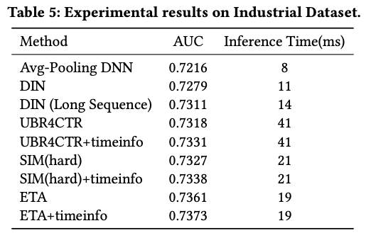

+++
title = '超长行为序列建模ETA'
date = 2024-03-23T16:04:10+08:00
draft = false
math = true
tags = ['Recommendation', 'Long Behavior Sequence']
+++

## SIM的问题

前面介绍过阿里巴巴超长行为序列建模的方法[SIM]()是two-stage，在预估的时候，SIM先通过target item从长行为序列中通过类目（hard-search）或item embedding相似度（soft-search）检索出top-K，再送到主模型中做target attention。由于类目索引和item embedding索引的构建是离线的，而CTR主模型很多时候需要online learning，这种情况下就造成用于检索的目标item embedding和离线构建的item embedding不在同一空间（离线的item索引存在滞后）。

[End-to-End User Behavior Retrieval in Click-Through Rate Prediction Model](https://arxiv.org/pdf/2108.04468.pdf) 是阿里主搜团队 基于此出发提出了End-to-end Target Attention - ETA，GMV提升3%。我们回到长序列问题本身，为啥不能像DIN/DIEN一样直接对超长序列做target attention——因为inference time吃不消（target attention需要对长序列中的每个item emebedding做inner product）。那么有没有其它方法可以快速从长序列中检索出top-K，又不需要像SIM那样最终要用到比如[faiss](https://github.com/facebookresearch/faiss)做快速的索引？

ETA就想到了[SimHash](https://www.cs.princeton.edu/courses/archive/spr04/cos598B/bib/CharikarEstim.pdf)！__通过将long behavior sequence item embeddings进行SimHash后，就能通过Hamming distance替代掉inner product，从而缓解长序列中inner product所带来的计算量问题__。

## Embedding SimHash后能快速的进行TopK检索

SimHash算法用于将每个item embedding映射成一个二进制的串（最终可以保存成一个整数），之前主要用于长文本相似度的比较。这里应用SimHash相当于把embedding当作长文本。

本文使用的SimHash伪代码如下，代码中共进行m次Hash，Hash的width=2即每次Hash返回二值0或1的$sig_k[i]$：

只要满足下面的条件，就能保证最终的计算复杂度能够降低：

1. 映射后的向量相似度计算函数的复杂度比inner product低（映射后的二进制向量用Hamming distance计算相似度，复杂度 < inner product）；
2. 映射后的向量长度比原item embedding长度小（m<d）；
3. Hash映射函数的复杂度不高；从伪代码看，Hash过程也需要计算内积，怎么感觉比inner product还高，Table 2里面的ETA的Retrieval complexity貌似也没把Hash函数的计算量考虑进去？主要原因是：__在inference阶段，模型训练好之后，item embedding都是lookup table，那我们可以把lookup table里面的所有embeddings都提前计算好它的$sig_k$，然后和Embedding Table以及模型一起存储下来，最终只要根据item查表得到$sig_k$就行。所以Inference的时候，理论上Hash函数的时间可以忽略不计__；

下图是采用SimHash之后，ETA对各种检索方法的时间复杂度、检索信息一致性的对比：相比直接inner product，ETA通过对item embedding做SimHash，然后用Hamming distance相似度函数进行检索。

有几个问题：

1. SimHash把d=128维度的embedding映射到了m=4维，且通过Hamming distance代替了inner product计算，这也就是ETA为什么能降低计算复杂度的核心原因。那如何保证映射后m=4维的向量后原d=128 embedding的信息不会丢失呢？SimHash有一个特殊的性质——locality sensitive hashing，即局部敏感哈希，也就是说空间上相近的两个embedding做完Hash之后位置依然大概率接近。
2. 如果是SimHash映射到m=4然后再计算相似度，那为什么不建embedding lookup table的时候就让d=4？核心是因为这里的复杂度降低，是将inner product计算替换成了Hamming distance计算，Hamming distance通过异或XOR运算复杂度可以控制在O(1)，所以不管怎么降低embedding dim都比较难达到Hamming distance这么低的计算复杂度。

## ETA (End-to-end Target Attention)

ETA结构左边就是SimHash的应用，具体的：

- 训练时：
  - 得到Long-term User Behavior Sequence的item_ids的embeddings $e_{k+1}...e_n$，和Target Item的embedding $e_t$；
  - 对每个embeddings和target embedding计算SimHash，得到每个embedding对应的m维的二进制向量；训练时SimHash的计算开销还是在的；
  - 用Hamming距离计算Target二进制向量和Behavior Sequence中的每个embedding距离，排序的到TopK ——注意这步top-K排序需要用计数排序或快排，才能将复杂度做到O(L\*B\*1)满足系统的性能要求；
  - 训练好之后将所有embedding table的SimHash的结果的存成lookup table，和模型一起打包部署；
- 预估时：
  - Long-term User Behavior Sequence的item_ids直接查询lookup table得到到每个item对应的m维的二进制向量；
  - Hamming距离计算相似度；
  - 排序得到TopK结果，Multi-Head Target Attention接入到主CTR模型中；

## 工程实现

- SimHash不参与反向传播，只用于检索TopK，但是输入长序列中item的embeddings会随着模型更新而更新（注意，SIM中这部分是延迟更新的）；
- Embeddings Hash的结果可以存成lookup table让SimHash过程在inference阶段基本没有计算开销，且因为每个结果都是0或1二进制，所以可以直接存成整数，进一步大大降低memory消耗；

关于效果：文章中没有和SIM(soft) + timeinfo做对比。SIM主要问题在于检索过程离线embedding的延迟；但ETA有没有自己的问题？当然有，embedding hash过程虽然说是LSH，但或多或少还是存在一些embedding的信息丢失，导致topK检索的精度打些折扣。

| AUC效果                                           | AB实验效果                                          |
| ----------------------------------------------- | ----------------------------------------------- |
|  |  |
