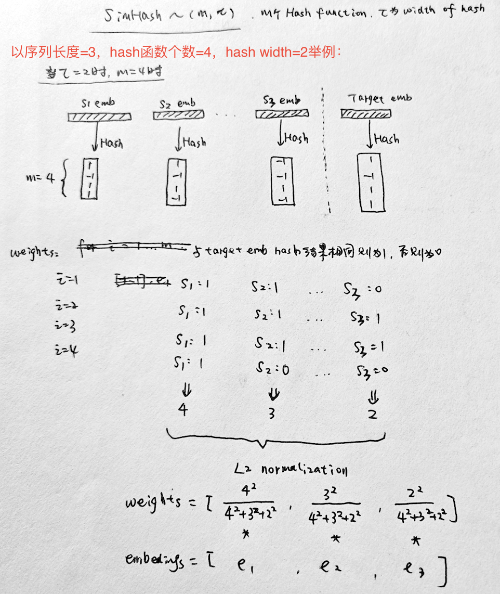

+++
title = '超长行为序列建模SDIM'
date = 2024-03-24T15:01:46+08:00
draft = false
math = true
tags = ['Recommendation', 'Long Behavior Sequence']
+++

## SIM和ETA的问题

- SIM通过类目从长序列中检索相关的items（hard-search）或者通过embedding inner product计算从长序列中检索最相似的topK个item；SIM的问题在 [ETA]() 中讲过，主要是离线索引可能带来的在线target item embedding和离线的item embeddings不一致的问题；
- ETA在SIM基础上，通过对Long Behavior Sequence的item embeddings进行SimHash（LSH）之后，然后就可以将inner product的耗时计算转化为Hamming distance计算。从而大大降低了计算量，可以把检索topK的过程放到线上模型中，解决了SIM在离线不一致的问题；但是ETA依然需要通过一个Multi Head Target Attention得到最终的Long Behavior Sequence Embedding表达；

不管是SIM还是ETA，都是基于检索的方法从长序列（>1000）的候选items中选出最相关的topK，美团的这篇文章[Sampling Is All You Need on Modeling Long-Term User Behaviors for CTR Prediction](https://arxiv.org/pdf/2205.10249.pdf) 则是吸收了ETA中Hash函数的特点，但不使用检索的方法，不通过Multi Head Target Attention，直接得到用户Long Behavior Sequence的embedding表达——SDIM（Sampling-based Deep Interest Modeling）。

## Hash-Based Sampling的用户行为建模

SimHash有Local Sentitive特性，也就是说空间距离相近的两个vector在Hash之后距离也 __大概率__ 相近。SDIM就是利用这个原理：

1. 将序列的所有Item Embeddings和Target Embedding通过m个Hash函数进行Hash（比如下图m=4）
2. Item Embedding每次Hash之后和Target Embedding落在同一个桶（Hash的LSH特性），则记为一次贡献；
3. 进行m次Hash之后，统计每个item embedding的贡献，最后用L2 normalization进行归一化得到每个item embedding的权重 weights（按理L1也可以，但是作者说L2效果更好）
4. 最后只需要将长序列的item embeddings通过weighted sum pooling求和就得到了Long Behavior Sequence的Embedding表达，完美避开了Multi Head Target Attention的操作；

当然，为了降低Hash冲突的风险，实际中需要将hash function数量m和Hash width设置得大一些。

为了说明通过Hash计算每个item embedding权重的方法是有效的，作者通过理论分析和数据验证（如下图），Hash得到的weights和Target Attention得到的weight很接近。

## 工程实现

Hash函数m和$\tau$的选择：

- m理论上是越大越好，实验发现>48之后效果差不多了；
- 而$\tau$并不是越大越好，太大了只能是极其相关的item才能贡献权重，太小了则回引入噪声items，原文的实验是=3左右；

| m的选择                                       | $t$的选择                                   |
| --------------------------------------------- | --------------------------------------------- |
|  |  |

总结一下：自我感觉这篇工作还是比较优雅简洁，易工程实现的，对旧系统的改造不大。
