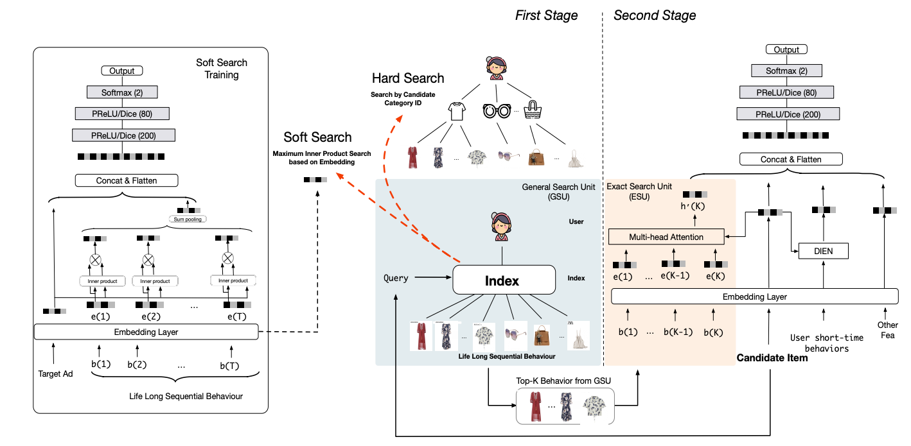

+++
title = '超长行为序列建模SIM'
date = 2024-03-21T18:00:55+08:00
draft = false
math = true
tags = ['Recommendation', 'Long Behavior Sequence']
+++

## 为什么推荐需要超长行为序列？

试想这么种场景，某个用户4个月前在某家店买了厕纸，2个月前又买了厕纸，然后中间又浏览了成千上万的其他东西，到现在又隔了两个月，应不应该推厕纸？

然而，对于模型来说，因为2个月前到现在中间浏览了成千上万的其他东西，而[DIN](https://arxiv.org/abs/1706.06978), [DIEN](https://arxiv.org/abs/1809.03672), [MIMN](https://arxiv.org/abs/1905.09248 "https://arxiv.org/abs/1905.09248")只能建模1000以下的行为序列，所以早就把厕纸从行为用户历史行为序列中剔除出去了。

所以：

- 第一，通过超长行为序列可以捕获用户长周期里面周期性或规律性的购买行为
- 第二，短序列只能刻画用户短时的兴趣偏好（买了几次盲盒，但无法确定是否二次元用户），但通过超长序列可以刻画用户的长期偏好（比如，除了最近几次的盲盒还买了很多手办，二次元用户）

任何事情也都有利弊，即使计算量不是问题，但直接把用户所有的历史行为序列到模型中，除了会引入有用信息，同时也引入了许多的噪音。如何从用户长历史中剔除噪声，提取有用的信息？SIM在一定程度上就是在解决这个问题。

> 题外话：LLM里面的RGA，不是也为了解决这种问题吗？

## SIM

Paper: [Search-based User Interest Modeling with Lifelong Sequential Behavior Data for Click-Through Rate Prediction](https://arxiv.org/pdf/2006.05639.pdf%5C%5B13%5C%5D)

SIM是Two-stage Model， 包括GSU和ESU阶段。注意，主结构中依然保留了User short-time behaviors的输入，在短时序的基础上做增量，毕竟最近的行为序列才是最重要的。

### General Search Unit (GSU)

GSU，通过线性时间复杂度，用于从原始超长序列中检索出top-K相关的子行为。文中介绍了两种GSU的方式，soft-search和hard-search。两种搜索的差别主要在序列中的item和目标item的相似度的计算上，

$$
r_i = \left\{
\begin{aligned}
sign (C_i=C_a) &    & hard-search \\
(W_be_i) \cdot (W_ae_a)^T &    & soft-search
\end{aligned}
\right.
$$

其中，$C_a$是目标item的category，$C_i$是序列中behavior item的category，即只从长序列中筛选同category的items；soft-search则是直接通过behavior item embedding和目标item embedding的内积（inner product）计算相似度，SIM使用的检索算法是ALSH（这也是召回里面常用的user向量检索item向量的方法）。

> 关于soft-search的item embedding：
>
> - 不能直接使用short behavior sequence的embedding，因为不在一个表达空间，embedding差异会比较大；所以才有了上图中左边Soft Search Training辅助任务；
> - Soft Search在原文中是和后面的ESU一起训练，得到behavior item embedding矩阵，线上serving的时候通过类似i2i召回，内积检索得到topK的item；但是，一起训练成本太高，behavior item的长期表达在短期内变化不大，这里是否可以定期离线训练？
> - soft-search training的技巧：当life long sequential behavior实在太长的时候（内存放不下），可以随机采样子行为序列，对最终item embedding的分布影响不大；

hard-search或soft-search的topK结果送到后续的ESU。

### Exact Search Unit (ESU)

ESU就是对TopK做multi-head attention，

$$
att_{score}^i=softmax(W_{bi}z_b \cdot W_{ai}e_a) \\
head_i=att_{score}^i z_b
$$

最终的长时间序列表达为多个head的concat：$U_{lt}=concat(head_1,...,head_q)$，剩下2个问题：

1. 为什么是multi-head？为了从长序列中提取多兴趣，长序列中一般包含多兴趣（比如电子爱好者，同时可能是二次元爱好者）；
2. $z_b$ 是什么，不是behavior item的embedding $e_b$么？z_b是 `behavior item embedding` 和 `behavior item与target item时间差` 的embedding concat，这里 `behavior item与target item的时间差` 这个timeinfo信息也很重要，从原文实验看，hard-search + timeinfo的提升基本和soft-search相当，千分之二的提升；

   > 题外话：timeinfo是连续or离散的，如果是连续的，怎么embedding呢？
   >

好了，剩下的就是把 ESU multi-head attention的结果 concat到短时序中进行训练了（soft-search条件允许是联合训练，hard-search部分不涉及训练过程）。

## 工程上的实现问题

工程问题：

1. Alibaba广告 精排打分延迟 < 30ms，有些场景甚至更短10ms内；
2. 在高并发的情况下（淘宝1亿+用户，峰值qps可能几十亿），用户超长行为的embeddings，在打分时内存的压力也是个问题；

针对问题1，原文离线实验发现soft-search和hard-search效果差不多（soft-search好2个千分点），最终选择上线上线hard-search + timeinfo；

针对问题2，把用户长行为序列建成KKV索引（Key-Key-Value）——User Behavior Tree，提前存储到数据库，模型在线hard-search直接从数据库中根据Key=user_id, Key=target_category索引得到ESU的输入topK；且通过索引的构建之后，hard-search的O(k)时间复杂度直接缩短到O(1)即在线serving长时序基本没有额外的开销。

另外，其实对于soft-search的上线，检索过程可以完全复用召回倒排索引（Inverted index）的框架。
