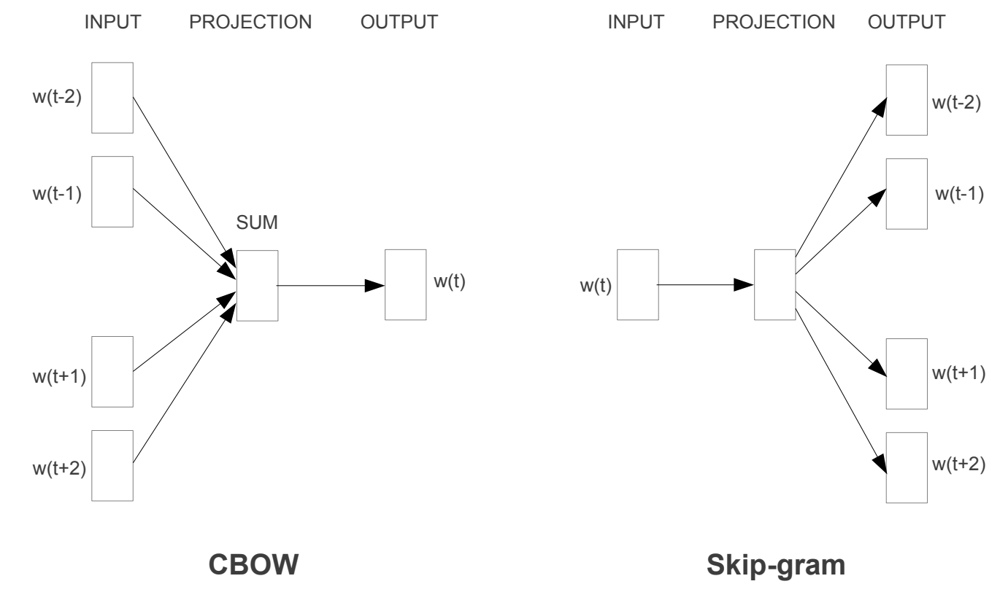
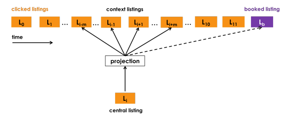
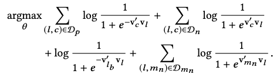
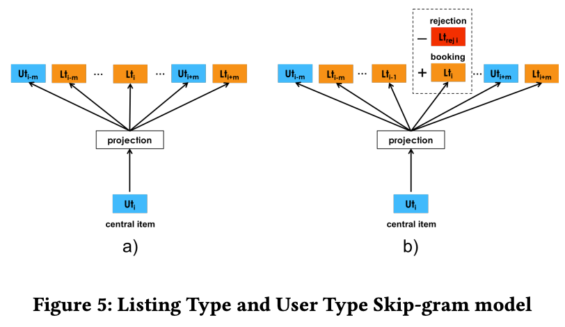
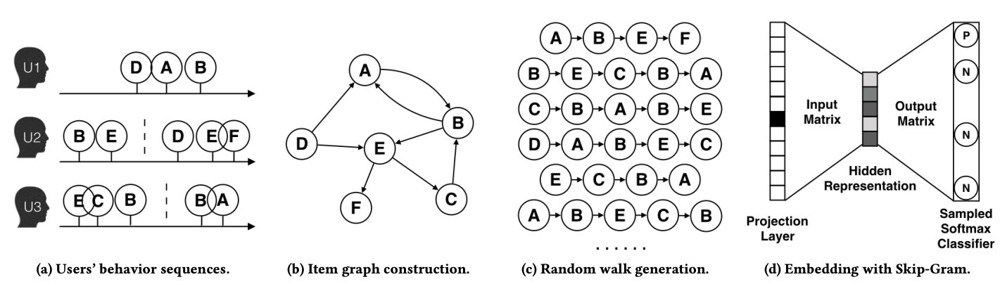
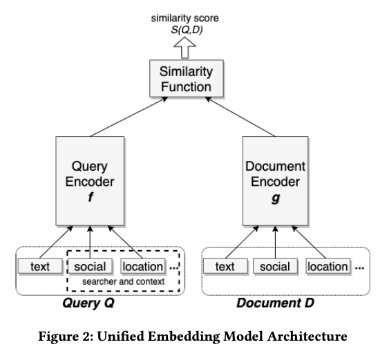

+++
title = '重读经典——word2vec'
date = 2024-03-31T15:32:32+08:00
draft = false
math = false
tags = []
+++

## 为什么需要重读word2vec

Word2vec原论文：

1. Tomas Mikolov, Kai Chen, Greg Corrado, and Jeffrey Dean. [Efficient estimation of word representations in vector space](https://arxiv.org/pdf/1301.3781.pdf). CoRR, abs/1301.3781,2013.
2. Tomas Mikolov, Ilya Sutskever, Kai Chen, Gregory S. Corrado, and Jeffrey Dean. [Distributed representations of words and phrases and their compositionality](https://arxiv.org/pdf/1310.4546.pdf). NIPS 2013.

其中1主要是描述CBOW和skip-gram相关方法，2描述了Negative Sampling以及训练word2vec的方法。为什么想要重读word2vec：

1. 推荐系统中，可以把item或user类比与word2vec中的word，很多i2i和u2i的方法都是借鉴的word2vec，以及召回中常用的NCE Loss和Sampled Softmax Loss都和word2vec相关；熟悉word2vec对了解召回，对如何像Aribnb [KDD18](https://www.kdd.org/kdd2018/accepted-papers/view/real-time-personalization-using-embeddings-for-search-ranking-at-airbnb)和阿里[EGES](https://arxiv.org/pdf/1803.02349.pdf)一样将word2vec改进应用到具体业务中，会非常有帮助；
2. 召回热门样本的处理，也可以借鉴word2vec中热门词的处理思路；
3. GPT的输入词是字符串，怎么表征输入到NN？当然，现在大家都很熟悉了embedding lookup table，embedding lookup table的其实最早差不多就是来自word2vec（更早影响没那么大暂且不提）；沿着这个拓展，因为词表太大，又在embedding前加了tokenizer过程；
4. word2vec是老祖级别的语言模型，那么最新的GPT和它主要区别在哪里？
5. 以及初次看GPT代码时，发现GPT的输出是softmax，word2vec其实loss也是softmax loss。但为什么在word2vec里面的softmax就需要Negative sampling，而GPT里却不需要？

## CBOW和skip-gram

word2vec核心思想是通过训练神经网络，将word映射到高维embedding。其embedding的思想对推荐系统、以及Bert,GPT等都影响深远。Word2vec一般有两种训练方法：CBOW和skip-gram。

CBOW是通过上下文（Context）学习当前word，假设词与词之间相互独立，则对应的极大似然学习目标为：

$$
E=-\log p(w_t|w_{t-1},w_{t-2},..,w_{t-c},w_{t+1},w_{t+2},...,w_{t+c}) \\
 = -\log \frac{e^{h \cdot v'_o} }{\sum_{j \in V} e^{h \cdot v'_j }} \\
 = - h \cdot v'_o + \log {\sum_{j \in V} e^{h \cdot v'_j}}
$$

其中，

1. Loss函数使用的Softmax多分类，类目数即为词典大小V（语言模型里面，V大概几万-十万）；
2. c是context窗口大小，在一个context内就认为相关，是个人工超参数，或根据一定规则动态调整；
3. h是CBOW的隐藏层输出，所有输入$w_{t-1},w_{t-2}...,w_{t+1},w_{t+2}$通过lookup table查到embedding查询得到 $v_{t-1},v_{t-2}...,v_{t+1},v_{t+2}$之后，再进行sum pooling的结果；即$h=1/C*(v_{t-1},v_{t-2},...,v_{t+1},v_{t+2},...)$，C为上下文长度；输入表达矩阵（lookup table）存储的就是word embedding的结果；
4. v'是输出矩阵表达，注意在word2vec里面，和输入表达矩阵（即lookup table）不一样；
5. h * v' 点乘运算，可以理解为是输入context的embedding（即sum pooing结果）和输出v'的相似度，最终loss算的是这个相似度的softmax loss；

Skip-gram与CBOW相反，它是则根据当前word来学习可能的上下文概率，对应的极大似然估计loss为：

$$
E=-\log p(w_{t-1},w_{t-2},...,w_{t-c},w_{t+1},w_{t+2},...,w_{t+c}|w_t) \\
 =-\log p(w_{t-1}|w_t,..,w_{t-c}|w_t,...,w_{t+1}|w_t,...,w_{t+c}|w_t) \\
 =-\log \prod_{i \in C} p(w_i|w_t) \\
 =-\sum_{i \in C} \log \frac{e^{v_i \cdot v'_o} }{\sum_{j \in V} e^{v_i \cdot v'_j }} \\
 =-\sum_{i \in C} e^{v_i \cdot v'_o} + C \log \sum_{j \in V} e^{v_i \cdot v'_j }
$$

其中，

1. Loss函数也是使用的Softmax多分类，类目数即为词典大小V；相比CBOW，这里最外层多了对Context的求和，C即为Context；
2. $v_i$是输入word通过lookup table查到的embedding，没有也无需sum pooling操作，因为skip-gram输入只有一个词；
3. 同样的，v'是输出矩阵表达，注意在word2vec里面，和输表达入矩阵（即lookup table）不一样；
4. v_i * v' 点乘运算，可以理解为是当前词的embedding和Context里每个其它的词的embedding计算相似度（注意这里输出词的embedding和输入词不是同一个词表），最终loss算的是这个相似度的softmax loss；

### Negative Sampling

到目前为止，已经有了CBOW和Skip-gram的原始优化目标。但是有个很棘手的问题——计算复杂度。假设词表大小是V，隐藏层维度是H，则每次loss计算，softmax的分母就需要$O(V*H^2)$次的乘法，这是不可接受的。为了有效的优化目标，工程实现上有 Hierarchical Softmax 和 Negative Sampling的方法。Hierarchical Softmax在工业界用得不多，Negative Sampling相对更容易实现，所以这里只讨论Negative Sampling。

Negative Sampling的Loss函数，一种方式是直接对负样本采样，比如包括自己就5类，直接在5类上计算softmax——Sampled Softmax Loss：

$$
Sampled Softmax Loss= \log \frac {e^{v_i \cdot v'_o}}{e^{v_i \cdot v'_o} + \sum_{j \in S_{neg}} e^{v_i \cdot v'_j}}
$$

另一种方式是采用NEC（Noise Contrastive Estimation）Loss，有文献证明NEC Loss可以近似上面的softmax loss。而工业界常用NEC的简化版本，NEG Loss：

$$
NEG Loss=-log (\frac {1}{1+e^{-v_i \cdot v'_o}}) - \sum_{j \in S_{neg}} log (1 - \frac {1}{1+e^{-v_i \cdot v'_j}}) \\
=-log\ \sigma(v_i \cdot v'_o) - \sum_{j \in S_{neg}} log\ \sigma(-v_i \cdot v'_j)
$$

其中，

1. S_neg为采样的负样本，一个正样本采样多个负样本；
2. NEG Loss实际上就是计算sigmoid函数的BCE Loss，只是负样本是采样得到的；

我们可以从另一个视角来理解NEGLoss更容易：构造样本，中心词w与上下文c同属一个窗口，则<w,c>样本的label为1；随机采样一些上下文c'，则 <w,c'>的样本label为0。建模w和context的联合概率$p(w,c)$——二分类就是sigmoid函数，不同于skip-gram和CBOW里面的条件概率，对应Loss为：

$$
NEGLoss = -\log (\prod_{(w,c) \in D_p} p(D=1|w,c) + \prod_{(w,c') \in D_n} p(D=0|w,c') ] ) \\
= -\sum_{(w,c) \in D_p} \log \frac{1}{1+e^{-v_c \cdot v_w}} - \sum_{(w,c') \in D_n} \log (1 - \frac{1}{1+e^{-v_c' \cdot v_w}}) \\
= -\sum_{(w,c) \in D_p} \log \sigma(v_c \cdot v_w) -\sum_{(w,c') \in D_n} \log \sigma(v_c' \cdot v_w)
$$

其中，Dp是正样本集合，Dn是采样的负样本集合。

Sampled Softmax Loss和NEG Loss在推荐系统中应用非常广泛，尤其是推荐系统的召回模型中。

### 高频词降采样

为了很好的完成对word embedding的训练，还有一个问题：对于'a', 'the', 'in'这种词，出现频率很高，但信息含量又很低，频繁的送入word2vec模型反而容易把模型带偏。为了处理这种imbalance的高频词，在训练时，word2vec采用下面的概率对word进行随机丢弃：

$$
P(w_i)=1-\sqrt{\frac{t}{f(w_i)}}
$$

其中

- f(w_i)就是词w_i出现的频率。100个词里面出现10词，则=1/10，代表热度；
- t是一个人工选定的阈值（原文$10^{-5}$）；

## word2vec与推荐算法

### item2vec

把item类比成word2vec中的word，就有了[item2vec](https://arxiv.org/pdf/1603.04259.pdf)，利用item的vector进行i2i协同过滤。且item2vec中使用了和word2vec一样的高频词降采样方法对热门item打压。

### [Real-time Personalization using Embeddings for Search Ranking at Airbnb](https://dl.acm.org/doi/pdf/10.1145/3219819.3219885)

Aribnb分别采用：

1. 用户click session的数据生成listing的embedding，捕捉短期的实时个性化；
2. 用户booking session的数据生成user-type和listing-type的embedding，捕捉中长期用户兴趣；

Listing embedding采用word2vec中的skip-gram模式（如下图），用户点击序列类比于word2vec的上下文，但是相比word2vec又做一些应用场景的适配：

1. 除了考虑上下文，如果有booking，在推荐中被认为是一个强信号，将booking也加到context中；因此其优化目标除了word2vec中的正负样本，还增加了booking listing的正样本（下面优化目的第3项）；
2. 酒店预定一般具有地理特性，即用户一般一个session都在浏览同一地区的酒店，如果只采用word2vec中的随机负采样，引入的都是easy样本（直接通过地区信号就能分辨出负样本），因此还需要引入一些hard samples，从central listing的相同地区采样部分hard样本，构成下面优化目标中的第4项；

| Listing Embedding                             | optimization target                           |
| --------------------------------------------- | --------------------------------------------- |
|  |  |

User-type和Listing-type Embedding也是skip-gram model，然后针对应用场景做特定的优化。

### EGES

[Billion-scale Commodity Embedding for E-commerce Recommendation in Alibaba](https://arxiv.org/pdf/1803.02349.pdf)

将word2vec中文本序列的表达扩展到graph的表达，将多个用户的行为序列画在graph上，在graph上随机游走生成新的item序列（类比text context window），根据生成的item序列用Skip-gram学习item embedding表达。

### DSSM

各大厂里面有很多将双塔用于推荐召回的例子，其对应的loss和负采样方法都一定程度借鉴的word2vec。比如：

1. Microsoft: [DSSM](https://www.microsoft.com/en-us/research/wp-content/uploads/2016/02/cikm2013_DSSM_fullversion.pdf) 2013：DSSM用于文档检索
2. Facebook: [Embedding-based Retrieval in Facebook Search](https://arxiv.org/abs/2006.11632), 2020：详细介绍了Facebook基于Embedding召回的工程实践
3. Google Youtube: [Sampling-bias-corrected neural modeling for large corpus item recommendations](https://research.google/pubs/sampling-bias-corrected-neural-modeling-for-large-corpus-item-recommendations/), 2019：Youtube双塔召回
4. Google Play: [Mixed Negative Sampling for Learning Two-tower Neural Networks in Recommendations](https://storage.googleapis.com/pub-tools-public-publication-data/pdf/b9f4e78a8830fe5afcf2f0452862fb3c0d6584ea.pdf), 2020：google play双塔召回

关于DSSM用于召回本身有很多工程细节，需要单独一篇文章去讲解。双塔最基本的结构基本如下：Query和Document的Embedding可以对应word2vec的输入表达和输出表达矩阵，只是word2vec的输入表达和输出表达都是word，而双塔模型中可能是i2i，也可能是u2i。

不管如何，双塔模型的negative sampling和loss函数与word2vec很相似，比如：

microsoft的dssm：negative sampled softmax loss，$ P(D|Q) = \frac{exp(\gamma R(Q,D))}{\sum_{D' \in D} exp(\gamma R(Q,D'))} $，就是sampled softmax loss，增加了温度超参数$\gamma$。

## word2vec与LLM

BERT和GPT延续了word2vec表征一切的思路，用大数据pre-training就能得到NLP的非常好的表征。然后，只要针对具体业务场景的少量数据做fine-tuning就可以达到很不错的效果。BERT和GPT相比word2vec的主要优势在于，word2vec只考虑了单个词的表征，没有考虑词在不同上下文下的差异，比如 apple 在I have an apple laptop和I want eat apple里面含义是完全不同的，所以用于表征apple的embedding也应该是不同的。

这里试着回答开头困惑的问题：

> GPT的输出是softmax，word2vec其实loss也是softmax loss。但为什么在word2vec里面的softmax就需要Negative sampling，而GPT里却不需要？

答：因为word2vec里面softmax的分母，包含了输入表征和输出表征向量的inner product，且每次迭代都要计算V次，这才是计算量大的根源，复杂度$O(V*H^2)$；而GPT最后一层是lm_head（[nn.Linear层](https://github.com/karpathy/nanoGPT/blob/325be85d9be8c81b436728a420e85796c57dba7e/model.py#L133C41-L133C47)），假设lm_head前的隐藏层输出为H，词典大小为V，复杂度仅为O(VH)，自然可以直接计算softmax loss。

## 参考

1. Xin Rong. word2vec Parameter Learning Explained. 2016.
2. Goldberg, Y. and Levy, O. (2014). word2vec explained: deriving mikolov et al.’s negativesampling word-embedding method. arXiv:1402.3722 [cs, stat]. arXiv: 1402.3722.
3. Mikolov, T., Chen, K., Corrado, G., and Dean, J. (2013a). Efficient estimation of word representations in vector space. arXiv preprint arXiv:1301.3781.
4. Mikolov, T., Sutskever, I., Chen, K., Corrado, G. S., and Dean, J. (2013b). Distributed representations of words and phrases and their compositionality. In Advances in Neural Information Processing Systems, pages 3111–3119.
5. Grbovic, Mihajlo, and Haibin Cheng. "Real-time personalization using embeddings for search ranking at airbnb."  *Proceedings of the 24th ACM SIGKDD international conference on knowledge discovery & data mining* . 2018.
6. nanoGPT. https://github.com/karpathy/nanoGPT/blob/325be85d9be8c81b436728a420e85796c57dba7e/model.py#L138C60-L138C107
